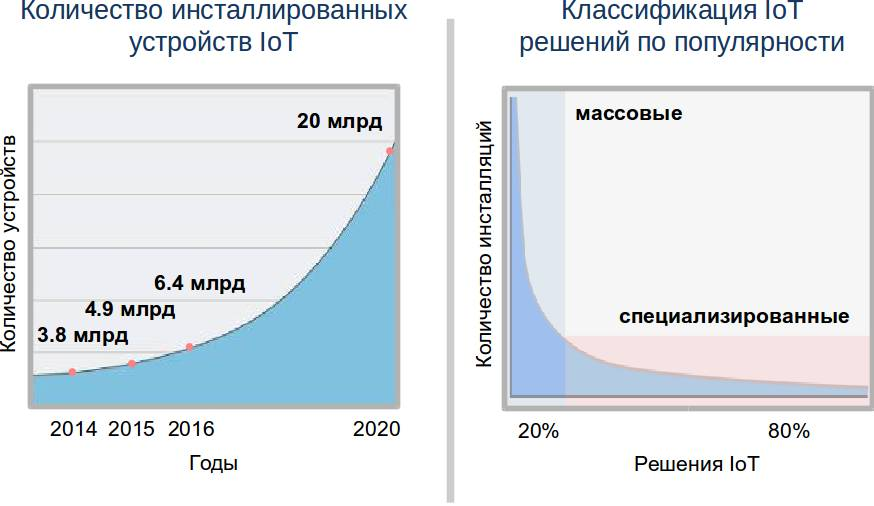
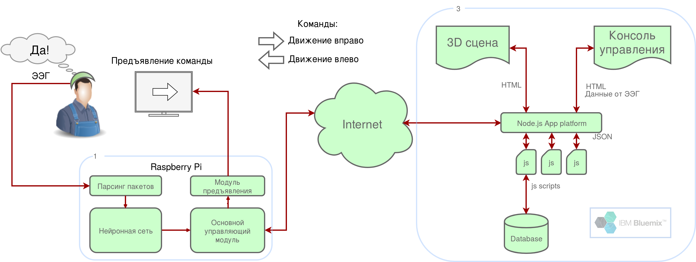
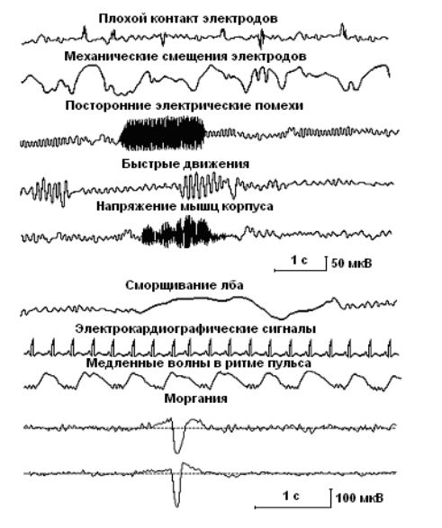
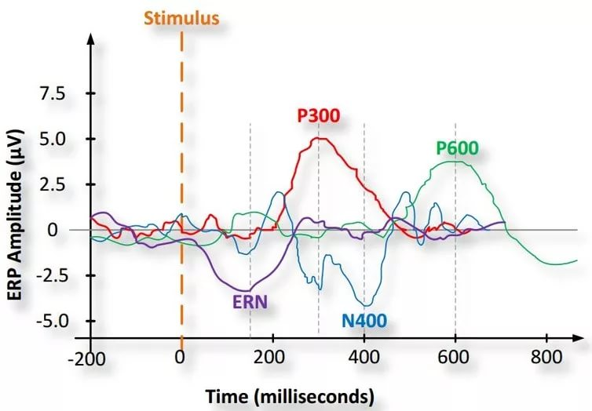
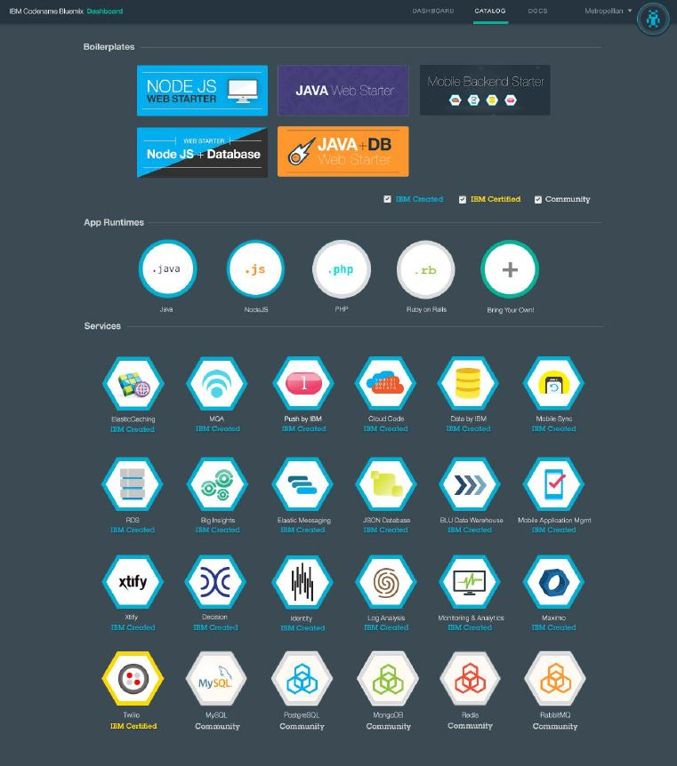
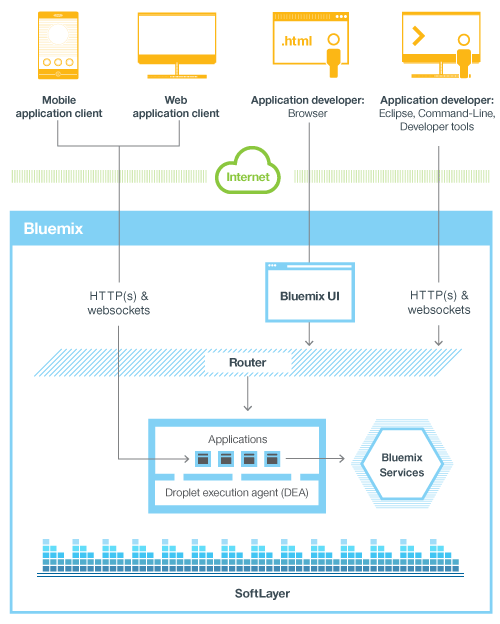
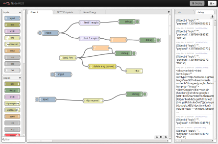
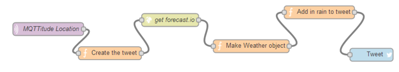

****
#1. Введение 

Воплощение потенциала идей, заложенных в концепцию Интернета вещей, способно существенно изменить уклад современной экономики. Благодаря внедрению масштабируемых облачных решений, использованию большого количества датчиков и распределенных микропроцессорных систем уже в ближайшее время могут быть созданы прорывные решения в таких областях, как: транспорт, сельское хозяйство, промышленное производство, здравоохранение, социальная сфера, быт и других. Все большее количество компаний обращает внимание на применение идей и технологий Интернета вещей для внедрения аналитики их деятельности и поиска новых возможностей для продуктов и услуг.

> *Интернет вещей (англ. Internet of Things, IoT) — это концепция вычислительной сети физических объектов («вещей»), оснащённых встроенными технологиями для взаимодействия друг с другом или с внешней средой.*
> 

Перечислим некоторые интересные факты:
-   По оценкам специалистов, к 2020 году к сети Интернет будет подключено до 50 млрд устройств, 20 млрд из них будут задействованы в инфраструктуре IoT.

-   До 90% данных, анализируемых устройствами Интернета вещей ранее не подвергались обработке.
-   До 60% данных, получаемых устройствами Интернета вещей, остаются актуальными лишь несколько миллисекунд.
-   В настоящее время только 0,1% устройств, способных выполнять полезную вычислительную нагрузку, подключены к сети.

Применение интерфейса мозг-компьютер (ИМК) в системах Интернета вещей в перспективе позволит устранить имеющиеся недостатки современных информационных и управляющих систем при взаимодейтсвии с человеком: т.е. необходимость обработки мышечной активности человека в качестве информации о реакции на внешние события. Целями передовых исследований и разработок коллективов ученых в области ИМК является расширение участия человека в принятии решений в кибер-физических системах, что способно существенно расширить их функциональность. Поэтому в нашем хакатоне мы также используем элементы ИМК, в частности, элекроэнцефалографы для анализа реакции человека на возникающие события. 

****
## 1.1. Инфраструктура типового решения IoT 

> 
>Под типовым решением Интернета вещей в данном конкурсе понимается распределенная кибер-физическая система, интегрирующая вычислительные ресурсы в физические процессы. В такой системе должны быть реализованы следующие основные функции:
> 

-   Сбор первичных данных с помощью сенсоров, расположенных в непосредственной близости от реальных объектов.
-   Управление объектами через актуаторы, подключенные к микрокомпьютерам.
-   Передача первичных данных от микрокомпьютеров в вычислительный хаб и в обратном направлении.
-   Первичная обработка данных в вычислительном хабе, формирование пакетов данных для передачи их в облако.
-   Получение и хранение данных в облаке.
-   Аналитическая обработка в облаке и формирование ключевых показателей эффективности (KPI) на основе данных об объектах, данных от сторонних источников, исторических данных.
-   Визуализация данных и результатов анализа на различных платформах: мобильных устройствах, носимой электронике, планшетах, компьютерах,     мониторах и пр.
-   Прием команд от внешних управляющих консолей.
-   Принятие решений на основе KPI и команд, выработка управляющих и информационных сообщений для актуаторов.
-   Передача управляющих сообщений в вычислительные хабы.

Примером подобной системы является структура, представленная на следующем рисунке.

**Пример решения Интернета вещей**

> 
> Мы используем в качестве примера автоматизированную систему для тренинга управления инвалидной коляскойна основе ИМК.***
> 

В примере использовано оборудование:

-   ЭЭГ (электроэнцефалограф), прибор для исследования активности головного мозга путем детектирования электрических импульсов, исходящих из различных его областей. 
-   Микрокомпьютеры на основе микроконтроллера STM32 раположен непосредственно внутри ЭЭГ прибора и служит для первичной обработки потенциалов электродов в цифровой код и их передачу вычислительному хабу.
-   Микрокомпьютер RaspberryPi используется в качестве вычислительного хаба.
-   Монитор используется для в качестве информационного табло для предъявления зрительных образов.
-   Облачная платформа IBM Bluemix для реализации сервисов хранения, аналитической обработки и визуализации данных.

Система работает следующим образом. 

**Функциональная схема проекта**

-	Работой всей системы управляет Основная программы, работающей на хабе (микрокомьютере RaspberryPi).
-	Цикл управления начинается с предъявленния человеку зрительного образа команды через монитор, подключенный к хабу. В хакатоне будет использован доступ графическому экрану хаба по протоколу `VNC` (например, с помощью программы VNCViewer). В качестве команд предъявляются поочередно два изображения: "Стрелка влево" и "Стрелка вправо", символизирующие поворото инвалидной коляски влево и вправо.
-	Человек, обученный методике P300, задумывает необходимую ему команду и мысленно отвечает "ДА" в тот момент, когда команда появляется на экране. В этом случае приблизительно через 300 мс после предъявления мозг человека активно реагирует на него вызванной волной P300.
-	С помощью ЭЭГ потенциалы от трех электродов обрабатываются (фильтруются от посторонних сигналов и наведенных потенциоалов), и передаются в виде пакетов данных через интерфейс USB в вычислительный хаб. 
-	Через 100 мс после предъявления данные ЭЭГ начинают накапливаться в программном FIFO буфере хаба, реализованном в Python. 
- 	По прошествии 500 мс от начала предъявления (данные принимаются в течении 400 мс для учета индивидуальных особенностей мозговой активности человека) прием данных заканчивается и пакет данных передается на искусственнуюнейронную сеть.
-	Режимом работы нейронной сети управляет приложение в облачной платформе `Bluemix`. Доступны два режима работы: обучение нейронной сети, рабочий режим. На веб-странице `Консоли управления` с помощью броузера возможно изменить режим работы. В таком случае режим передается в вычислительный хаб.
-	Нейронная сеть принимает данные из FIFO и классифицирует наличие (или отсутствие) вызванной волны P300.
-	Информация о результате классификации, а также первичные данные от ЭЭГ, передаются в Консоль управления.
-	Информация о результате классификации передается в приложение, имитирующее 3D движение инвалидной коляски в пространстве. В результате выполняет изменение сцены движения с оответствии с поступившей командой.
-	После завершения обработки предыдущей команды, Основная программа переходит к выдаче следующей команды.
 

****

## 1.2. Интерфейс "мозг-компьютер" на основе вызванной волны P300

Основноей целью применения ИМК является получение компьютерной системой однозначно интерпретируемых команд непосредственно от головного мозга без использования мышечной активности. Для разработки ИМК следует рассматривать три основные парадигмы ([1](#pub1)):

- ***Неинвазивный ИМК, основанный на распознавании ментальных состояний***, вызванных воображаемым выполнением движений. Он обеспечивает формирование дискретных управляющих команд и требует минимального времени обучения оператора при достаточно высокой производительности.

- ***Неинвазивный ИМК, использующий принцип непрерывного управления***. После выработки навыка управления, такой ИМК позволяет управлять внешним устройством как собственным (виртуальным) исполнительным органом, не требуя ментального кодирования дискретного набора команд.

- ***Инвазивный ИМК, основанный на двусторонней связи мозг-компьютер*** посредством имплантируемых электродов и позволяющий полностью инкорпорировать внешние технические устройства во внутреннюю нейронную модель схемы тела и, соответственно, оперировать с ними так же, как и с естественными исполнительными
органами. 

> 
>В хакатоне нами будут применятся неинвазивные ИМК первого типа, построенные на основе многоканальной `эктроэнцефалограммы головного мозга (ЭЭГ)`. В основе такой системы лежит регистрация электрического потенциала на поверхности головы и его компьютерная обработка.
> 

В ЭЭГ человека прослеживается определенная ритмическая активность, которая делится на несколько групп в зависимости от частоты волн (`альфа-ритм`, `бета-ритм`, `гамма-ритм`, `дельта-ритм`, `мю-ритм`). Для состояния бодрствования характерны бета- и мю-ритмы. Гамма- и дельта-ритмы появляются при засыпании и во сне. Альфа-ритм появляется при закрывании глаз, а также в медитативных состояниях. В связи с этими особенностями ритмов в ИМК наиболее часто используются мю-, бета- и альфа-ритмы.

****

**Основные ритмы ЭЭГ человека ([2](#pub2))** 

****

**Регистрируемые на ЭЭГ потенциалы, возникающие не в головном мозге - артефакты ([3](#pub3))** 

****
### 1.2.1. Интерфейсы на основе мю-ритма 

Интерфейсы на основе мю-ритма ([4](#pub4)), как правило, используют моторное воображение (motor imaginery, MI) – мысленное воображение движений (например, поднятия левой или правой руки), при котором человек не совершает реальных движений. При представлении движений происходит подавление характерного для состояния бодрствования мю-ритма (частотой 7-11 Гц), регистрируемого электродами, расположенными на коже головы в центральных и центрально-височных областях. Пользователя подобным интерфейсом инструктируют, что в момент, когда он хочет отдать команду интерфейсу, он должен представить то или иное движение. Классификатор обучают различать два типа электрической активности – наличие мю-ритма (синхронизация) и отсутствие мю-ритма (десинхронизация, замещение мю-ритма в ЭЭГ менее синхронными низкоамплитудными колебаниями). Таким образом, после обучения классификатора, можно установить, что в момент, когда произошла десинхронизация мю-ритма, пользователь хотел отдать команду, и запрограммировать компьютер на определенные действия, совершаемые в этом случае.

Так, в одном из исследований с применением подобного интерфейса, айтрекинг использовался для отслеживания взгляда пользователя, выбирающего одну из нескольких целей на мониторе компьютера, а моторное воображение – для подтверждения выбора (O’Doherty et al., 2014). В другом исследовании к компьютеру была подключена система управления экзоскелетом руки, который был разработан для больных гемипарезом. С помощью айтрекинга происходило отслеживание намерения пользователя взять тот или иной объект в реальной среде (выбор цели), а моторное воображение использовалось для контроля различных параметров движения руки (скорость, ускорение) и для конечного захвата объекта (Frisoli et al., 2012). Существуют и другие варианты интерфейсов. Интерфейсы, использующие моторное воображение, удобны в использовании, так как обеспечивают интуитивное управление (представил движение – произошло движение, при условии, что интерфейс подключен, например, к роботизированной руке), но требуют достаточно длительного обучения.

****
### 1.2.2. Интерфейсы на основе альфа-ритма 

Интерфейсы, использующие альфа-ритм, устроены таким образом, что для отдачи определенной команды нужно закрыть глаза. Пример подобного гибридного интерфейса – система управления роботизированной рукой, в которой саккады использовались для перемещения руки в одном из четырех направлений, а для сжатия руки пользователю необходимо было закрыть глаза, при этом интерфейс улавливал изменение в электроэнцефалограмме (появление альфа-ритма) (Postelnicu et al., 2011). Интерфейсы также вполне успешно работают, но минус достаточно очевиден – при отдаче команды ненадолго теряется зрительная связь с окружающей средой, и, кроме того, подобное управление несколько утомительно. Кроме того, у некоторых людей альфа-ритм слабо выражен, что затрудняет широкое применение интерфейсов, использующих его для управления.

****
### 1.2.3. Интерфейсы на основе SSVEP и айтрекинг 

В других гибридных интерфейсах используются зрительные вызванные потенциалы стабильного состояния (SSVEP) и айтрекинг. SSVEP - устойчивые зрительные вызванные потенциалы, которые возникают при стимуляции на частоте от 3,5 до 75 Гц (Beverina et al, 2003), при этом частота потенциалов повторяет частоту предъявления зрительных стимулов. Пользователей данных интерфейсов инструктируют, что для отдачи команды необходимо сосредоточить внимание на зрительном стимуле. Классификатор обучается различать изменения в ЭЭГ при появлении SSVEP на стимул, мигающий с определенной частотой. Один из примеров подобной гибридной системы – система для набора текста, совмещающая в себе SSVEP и айтрекинг (Lee et al., 2013). В этой системе 30 клавиш (буквы английского алфавита и другие кнопки, необходимые для ввода текста) постоянно мигали, каждая на своей частоте, для выбора определенной буквы нужно было сконцентрировать внимание на ней, при этом контролировалось положение взгляда. В случае, если оно сильно не соответствовало положению клавиши, команда напечатать букву не отдавалась.

Другой пример гибридного интерфейса, совмещающий в себе ИМК-SSVEP и айтрекинг – система управления простой игрой, в которой нужно собрать паззл (Kos’Myna, 2013). 

Интерфейсы на основе SSVEP и айтрекинга, в которых используется  большое количество стимулов, в ряде случаев могут вызывать достаточно сильное утомление,  так как пользователю приходится постоянно смотреть на экран, где мигает большое число стимулов на разной частоте. Кроме того, при некоторых условиях они потенциально эпилептогенны.

****
### 1.2.4. Интерфейсы, использующие P300

Компонент Р300 возникает в ответ на неожиданный редко предъявляемый (например, предъявляемый с вероятностью 0.2) значимый стимул, когда он появляется среди часто предъявляемых незначимых стимулов. 

Р300 возникает примерно на 300 мс после предъявления значимого стимула, имеет длительность около 300–400 мс и положительную амплитуду 5–15 мкB. Максимальная амплитуда Р300 наблюдается под центральным электродом. Чем реже предъявляется значимый стимул, тем больше амплитуда Р300. Как правило, требуется несколько усреднений для его выделения из фоновой активности. Р300 зависит от внимания испытуемого, но не от физических параметров стимула.

Р300 — часть сложного потенциала, отражающего процессы переработки информации в мозге, связанные с направленным вниманием при выполнении когнитивной задачи. Физические параметры стимула отражаются в параметрах ранних компонентов вызванных потенциалов. Процессы опознания и классификации стимулов отражаются в компонентах с латентность 96-250 мс после начала стимула, которые принято обозначать как волну N200. Непосредственно с потенциалом P300 связаны завершающие этапы обработки информации - окончательная классификация стимула и принятие решения о действии, связанном со стимулом (Picton, 1992). Существуют некоторые особенности эндогенных вызванных потенциалов на различные зрительные стимулы. Так, некоторых работах показано, что ЗВП на изображения лиц имеют характерные именно для такой стимуляции компоненты (Zhang et al., 2012).

Для выделения P300 используется «оддболл» парадигма или ее модификации – человеку предъявляются целевые и нецелевые стимулы (зрительные или слуховые), причем целевых стимулов на порядок меньше, дается задание считать редкие стимулы про себя. Электроэнцефалограмму разбивают на эпохи относительно подачи редкого стимула, полученные отрезки суммируют, таким образом выделяются вызванные потенциалы, в которых с латентностью около 300 мс появляется волна P300  (цифра «300» в названии как раз и указывает на латентность этой волны). 

Классический интерфейс на основе волны P300 – система для печати, которая представляет собой матриц из букв, в которой последовательно подсвечиваются строки и столбцы (Farwell, Donchin, 1998). Пользователь отмечает про себя (как правило, счетом) появление строки или столбца, содержащего нужную ему букву. Каждая строчка и столбец подсвечивается по нескольку раз, в быстром темпе, что позволяет усреднить реакции на стимулы и выделить, в каких из них наблюдается P300. Таким образом, находя строчку и столбец, на которые удалось выделить такую реакцию, определяют букву, которую хотел напечатать пользователь.

**Позитивный компонент зрительного вызванного потенциала с латентностью около 300 мс (Вызванная волна P300) ([3](#pub3))**

Интерфейсы, использующие P300, на данный момент получили широкое распространение, на их основе разрабатываются устройства для парализованных людей (системы для печати букв, инвалидные коляски), игровые приложения (Kaplan et al., 2013), а также ИМК-P300 используются в таких необычных исследованиях, как создание виртуальной реальности и рисование силой мысли (Fazel-Rezai et al., 2012).

****

## 1.3. Облачная платформа *Bluemix* 

***Bluemix*** — это открытое облачное предложение типа PaaS
(*Platform-as-a-Service*) на базе проекта с открытым исходным кодом Cloud Foundry. Эта платформа предназначена для разработки и хостинга приложений, а также упрощения задач по управлению инфраструктурой. Она позволяет быстро создавать и развертывать приложения, а также управлять ими.

***Bluemix*** обеспечивает следующие возможности:

-   быстрое и инкрементное составление приложений из сервисов;
-   непрерывное внесение изменений в приложения и обеспечение постоянной доступности;
-   поддержка высокоспециализированных моделей программирования и сервисов для конкретных рабочих нагрузок;
-   встраивание высокой степени управляемости в сервисы и приложения;
-   оптимизация и эластичная адаптация к рабочей нагрузке.

**Каталог компонентов Bluemix**

Платформа *BlueMix* достигает этих целей посредством абстрагирования и скрытия большинства сложностей, традиционно сопутствующих хостингу приложений в облаке и управлению ими в облачной среде. *Bluemix* может быть использована разработчиками для создания и применения самых разных приложений, включая веб-приложения, мобильные приложения, приложения для работы с большими данными, приложения для разумных устройств и т.д. *Bluemix* поддерживает разработку на популярных языках программирования и средах разработки. Java-технологии, средства создания серверных частей для мобильных приложений, мониторинг приложений, технологии с открытым исходным кодом и т. д. — все эти возможности
доступны в облаке как сервисы.

Каталог *Bluemix* содержит большую часть из того, что необходимо для быстрого начала работы, большое количество шаблонов, заранее сконфигурированны наборов сервисов, сред исполнения и примеров кода, готовых к использованию:

-   сред исполнения, в том числе: Liberty for Java, Node.js, Ruby on Rails;
-   веб-сервисов и сервисов приложений, в том числе: Data/Session Cache,  ElasticMQ, Decision, SSO, Log Analysis, Redis, RabbitMQ, Twilio;
-   мобильных сервисов, в том числе: push-уведомлений, Cloud Code,     Mobile Application Management, Mobile Quality Assurance;
-   сервисов управления данными, в том числе: MongoDB, реляционной базы данных от IBM, JSON-базы данных от IBM, MySQL, PostgreSQL, MobileData, Mobile Sync, BLU Data Warehouse, MapReduce;
-   сервисов мониторинга и анализа;
-   сервисов DevOps Services (прежнее название: JazzHub).

****

## 1.4. Краткое описание концепций *Bluemix* 

В терминологии *Bluemix* приложение (*application*) — это созданный вами артефакт, т. е. весь программный код (исходный код или исполняемые двоичные файлы), который необходимо запустить или на который необходимо сослаться в процессе исполнения. Мобильные приложения выполняются за пределами среды *Bluemix* и используют сервисы *Bluemix*, представленные приложениями. В случае веб-приложений приложение — это код, загруженный на платформу *Bluemix* с целью хостинга. Кроме того, платформа *Bluemix* способна осуществлять хостинг программного кода приложения, который вы хотите выполнять на внутреннем сервере в среде на базе контейнера.

На рисунке показаны принципы взаимодействия *Bluemix* с клинтскими приложениями.

**Принципы взаимодействия *Bluemix* с клинтскими приложениями**

***Сервис (service)*** — это код, работающий на платформе *Bluemix* и предлагающий некоторую функциональность, которую могут использовать приложения. Это может быть готовый сервис, используемый непосредственно — например, push-уведомления для мобильных приложений или эластичное кэширование для веб-приложения. Вы также можете создавать собственные сервисы в диапазоне от простых служебных функций до сложной
бизнес-логики.

***Организация (organization) и пространство (space)*** — это организационные единицы инфраструктуры, способные хранить и отслеживать ресурсы приложения. Организация содержит домены (domain), пространства и пользователей. Пространство содержит приложения и сервисы. По умолчанию используется три пространства: Development (разработка), Production (производство) и Staging (подготовка). Для приложений, которым требуется среда типа PaaS, предоставляются buildpack-пакеты, каждый из которых представляет собой набор скриптов для подготовки кода к исполнению на целевой PaaS-платформе. Buildpack-пакеты, которые включают необходимую вашим приложениям среду исполнения и могут также содержать специализированные инфраструктуры, упрощают развертывание приложения в облаке по сравнению с самостоятельной установкой и конфигурированием среды исполнения.

Использование сервисов в *Bluemix* включает три этапа:
1.  Сообщите платформе *Bluemix*, что вам требуется новый экземпляр сервиса и какое конкретное приложение будет использовать этот новый экземпляр.
2.  *Bluemix* автоматически инициализирует новый экземпляр этого сервиса и свяжет его с приложением.
3.  Приложение взаимодействует с сервисом.

***Пакеты сервисов (Service bundles)*** — это коллекции API-интерфейсов, используемых в конкретных областях. Например, пакет Mobile Services включает сервисы MobileData, Cloud Code, Push и Mobile Application Management. Доступные сервисы и среды исполнения представлены в каталоге Bluemix. Кроме того, вы можете зарегистрировать собственные сервисы.

### 1.4.1. Развертывание и управление приложением 

Чтобы развернуть свое приложение, необходимо загрузить его в среду *Bluemix* и указать, сколько экземпляров этого приложения должно исполняться, а затем сконфигурировать *Bluemix*, введя необходимую информацию для поддержки этого приложения.

В случае мобильного приложения среда *Bluemix* содержит артефакт, который представляет серверную часть мобильного приложения — набор сервисов, который использует приложение для взаимодействия с сервером. *Bluemix* поддерживает серверные компоненты мобильного приложения, взаимодействующие с сервисами PushWorks, Cloud Code и Mobile Data, непосредственно из пользовательского интерфейса *Bluemix*.

В случае веб-приложения необходимо предоставить в *Bluemix* соответствующую информацию о среде исполнения и среде разработки, чтобы платформа смогла сформировать надлежащую инфраструктуру для исполнения этого приложения.

При развертывании приложений и управлении ими можно использовать инструмент командной строки cf, веб-интерфейс *Bluemix* или сервисы DevOps Services.

Браузерные и мобильные клиенты — а также другие приложения, развернутые на платформе *Bluemix* и выполняющиеся за ее пределами — взаимодействуют с приложениями, работающими на платформе *Bluemix*, через API-интерфейсы типа REST/HTTP. Каждый клиентский запрос маршрутизируется к одному из экземпляров приложения или составляющих его сервисов. Среды исполнения приложений в *Bluemix* изолированы друг от друга даже тогда, когда они находятся на одной и той же физической машине.

В ходе управления приложениями можно запускать, останавливать, перезапускать экземпляры приложения (или, в случае веб-приложения, изменять их количество), а также изменять объем памяти, используемый приложением. Ключевая конструктивная особенность *Bluemix* — отличные показатели при хостинге масштабируемых приложений и артефактов приложений. На данный момент эта платформа не масштабирует приложение автоматически в соответствии с нагрузкой, поэтому этим процессом необходимо управлять самостоятельно посредством создания или удаления экземпляров при изменении рабочей нагрузки. По этой причине ваши приложения должны сохранять все персистентные данные за пределами приложения в одном из сервисов хранения данных, предоставляемых платформой *Bluemix*. При повторном развертывании приложения после обновления используется тот же процесс, что и при начальном развертывании. *Bluemix* останавливает все исполняющиеся экземпляры и переводит новые экземпляры в рабочее состояние автоматически.

### 1.4.2. Сервисы DevOps Services для *Bluemix* 

При использовании DevOps Services требуется лишь несколько простых шагов для организации взаимодействия с другими специалистами с целью планирования, отслеживания и создания программного обеспечения в облаке. Вы можете воспользоваться встроенным в браузер редактором программного кода, который DevOps Services предоставляет для разработки приложений, или использовать DevOps Services с Eclipse, с VisualStudio или с инструментом командной строки Git для написания кода приложения и развертывания его на платформе BlueMix.

При работе с пользовательским интерфейсом, который помогает разработчику быстро добавлять сведения "кто", "что" и "когда" для своего рабочего проекта, требуется потратить всего несколько минут на задание дат, документирование первого сценария применения, назначение одной-двух задач и переход непосредственно к написанию программного кода.

DevOps Services включает встроенные средства управления исходным кодом — Jazz SCM и хостинговый Git. Каждый проект получает свой собственный репозиторий DevOps Services и рабочее пространство, в котором участники этого проекта могут регистрироваться свои изменения, ассоциировать изменения программного кода и просматривать историю недавних изменений. Кроме того, вы можете создать проект DevOps Services и указать на свой репозиторий GitHub.

Вы также можете с легкостью связать элементы работы с изменениями кода в GitHub. Кроме того, для написания кода в Git вы можете использовать имеющиеся у вас инструменты.

Типичными сценариями использования ресурса DevOps Services являются:

-   Создание приложения для анализа данных социальных сетей с использованием Node.js, Node-RED, Express, sentiment и ntwitter.
-   Создание приложения для создания интерактивных опросов в реальном     времени с использованием Node.js, Node-RED, Express, AngularJS и MongoDB.
-   Построение сервисов уведомления с использованием Node.js, Node-RED и MongoDB.
-   Создание приложений для управления аппаратными устройствами c использованием Node-RED и IoT компонент.

### 1.4.3. Среда визуальной разработки JavaScript приложений Node-RED 

**Node-RED** - это визуальная drag-and-drop среда разработки JavaScript рантаймов для IoT (неблокирующих приложений, управляемых событиями). Благодаря большому количеству примитивов и возможности быстрой визуальной настройки и созданию новых компонентов, в том числе непосредственно на языке JavaScript, Node-RED может быть использована как непрофессиональными пользователями, так и профессиональными разработчиками для ускорения создания веб-приложений в облаке. Это позволяет использовать Node-RED для взаимодействия с недорогими аппаратными платформами в рамках подхода IoT, перенося основную часть вычислительной нагрузки на облачную платформу. Помимо этого все созданные рантаймы могут быть объединены в библиотеки решений и впоследствии перенесены в другие проекты благодаря функциям экспорта и
импорта.

### 1.4.4. Терминология Node-RED 

*Нод (node)* - функционально законченный блок.

*Поток обработки (flow)* - цепь соединенных нодов и соответствующий им конфигурационный нод.

*Входной нод (input node)* - нод, принимающий внешние данные и задающий начало потоку обработки (flow). Входной нод имеет один или несколько выходных портов (output ports).

*Выходной нод (output node)* - нод, завершающий поток обработки и передающий результаты во внешнюю среду.

*Функциональный нод (function node or query node)* - нод, находящийся внутри потока обработки и имеющий один входной порт и один или несколько выходных портов.

*Конифигурационный нод (config node)* - нод, содержащий конфигурационную информацию, используемую в других нодах. Конфигурационный нод не связан портами с другими типами нодов.

*Набор нодов (node set)* - ноды, включенные в связанные js/html файлы (пары соответствующих друг другу файлов, содержащих связанный код JavaScript и HTML). Ошибка в js/html паре приводит к неработоспособности всех нодов набора.

*Модуль нодов (node module)* - множество связанных js/html файлов (и, соответственно, наборов нодов), где каждая пара описана в package.json файле.

*Пакет нодов (node pack)* - коллекция связанных по функциональности нодов, которые могут быть использованы разработчиком в рамках одного проекта.

**Основное окно проекта в Node-RED**

### 1.4.5. Пример использования Node-RED 

Примером эффективного применения технологии Node-RED может служить проект, на разработку которого требуется около 15 минут. Приложение позволяет автоматически отслеживать текущее местоположение мобильного устройства, определяет прогноз погоды и сообщает о нем через твиттер самому пользователю.

**Поток обработки для информирования о прогнозе погоды**

Решение работает следующим образом:

-   Приложение на мобильном телефоне передает телеметрическую информацию о положении устройства в обрабатывающий поток Node-RED.
-   Телеметрическая информация о местоположении преобразуется в twitter сообщение.
-   Сообщение используется для доступа к прогнозу погоды в ноде Forecast.io.
-   Полученный прогноз форматируется в сообщение twitter.
-   Сообщение посылается на твиттер аккаунт пользователя и отображается на мобильной платформе.

Приведенный пример позволяет реализовать логику взаимодействия с использованием протоколов MQTT, HTTP и Twitters API без глубокого погружения в их технические особенности.

