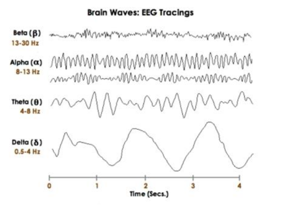
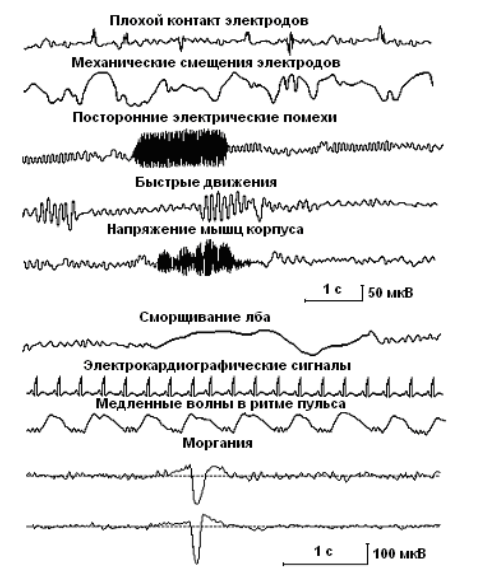

# Интерфейс "мозг-компьютер" на основе методики P300

Основноей целью применения ИМК является получение компьютерной системой однозначно интерпретируемых команд непосредственно от головного мозга без использования мышечной активности. Для разработки ИМК следует рассматривать три основные парадигмы [по материалам [1]](#pub1):

--- Неинвазивный ИМК, основанный на распознавании ментальных состояний, вызванных воображаемым выполнением движений. Он обеспечивает формирование дискретных управляющих команд и требует минимального времени обучения оператора при достаточно высокой производительности.

--- Неинвазивный ИМК, использующий принцип непрерывного управления. После выработки навыка управления, такой ИМК позволяет управлять внешним устройством как собственным (виртуальным) исполнительным органом, не требуя ментального кодирования дискретного набора команд.

--- Инвазивный ИМК, основанный на двусторонней связи мозг-компьютер посредством имплантируемых электродов и позволяющий полностью инкорпорировать внешние технические устройства во внутреннюю нейронную модель схемы тела и, соответственно, оперировать с ними так же, как и с естественными исполнительными
органами. 

В хакатоне нами будут применятся неинвазивные ИМК, построенные на основе многоканальной эктроэнцефалограмма (ЭЭГ). В основе такой системы лежит регистрация электрического потенциала на поверхности головы и его компьютерная обработка.

В ЭЭГ человека прослеживается определенная ритмическая активность, которая делится на несколько групп в зависимости от частоты волн (альфа-, бета-, гамма-, дельта, мю-ритмы). Для состояния бодрствования характерны бета- и мю-ритмы. Гамма- и дельта-ритмы появляются при засыпании и во сне. Альфа-ритм появляется при закрывании глаз, а также в медитативных состояниях. В связи с этими особенностями ритмов в ИМК наиболее часто используются мю-, бета- и альфа-ритмы.

**Основные ритмы ЭЭГ человека** 

[по материалам [2]](#pub2)

**Регистрируемые на ЭЭГ потенциалы, возникающие не в головном мозге - артефакты** 

[по материалам [3]](#pub3)

### Интерфейсы на основе мю-ритма

[по материалам [4]](#pub4)

Интерфейсы на основе мю-ритма, как правило, используют моторное воображение (motor imaginery, MI) – мысленное воображение движений (например, поднятия левой или правой руки), при котором человек не совершает реальных движений. При представлении движений происходит подавление характерного для состояния бодрствования мю-ритма (частотой 7-11 Гц), регистрируемого электродами, расположенными на коже головы в центральных и центрально-височных областях. Пользователя подобным интерфейсом инструктируют, что в момент, когда он хочет отдать команду интерфейсу, он должен представить то или иное движение. Классификатор обучают различать два типа электрической активности – наличие мю-ритма (синхронизация) и отсутствие мю-ритма (десинхронизация, замещение мю-ритма в ЭЭГ менее синхронными низкоамплитудными колебаниями). Таким образом, после обучения классификатора, можно установить, что в момент, когда произошла десинхронизация мю-ритма, пользователь хотел отдать команду, и запрограммировать компьютер на определенные действия, совершаемые в этом случае.

Так, в одном из исследований с применением подобного интерфейса, айтрекинг использовался для отслеживания взгляда пользователя, выбирающего одну из нескольких целей на мониторе компьютера, а моторное воображение – для подтверждения выбора (O’Doherty et al., 2014). В другом исследовании к компьютеру была подключена система управления экзоскелетом руки, который был разработан для больных гемипарезом. С помощью айтрекинга происходило отслеживание намерения пользователя взять тот или иной объект в реальной среде (выбор цели), а моторное воображение использовалось для контроля различных параметров движения руки (скорость, ускорение) и для конечного захвата объекта (Frisoli et al., 2012). Существуют и другие варианты интерфейсов. Интерфейсы, использующие моторное воображение, удобны в использовании, так как обеспечивают интуитивное управление (представил движение – произошло движение, при условии, что интерфейс подключен, например, к роботизированной руке), но требуют достаточно длительного обучения.

### Интерфейсы на основе альфа-ритма 

Интерфейсы, использующие альфа-ритм, устроены таким образом, что для отдачи определенной команды нужно закрыть глаза. Пример подобного гибридного интерфейса – система управления роботизированной рукой, в которой саккады использовались для перемещения руки в одном из четырех направлений, а для сжатия руки пользователю необходимо было закрыть глаза, при этом интерфейс улавливал изменение в электроэнцефалограмме (появление альфа-ритма) (Postelnicu et al., 2011). Интерфейсы также вполне успешно работают, но минус достаточно очевиден – при отдаче команды ненадолго теряется зрительная связь с окружающей средой, и, кроме того, подобное управление несколько утомительно. Кроме того, у некоторых людей альфа-ритм слабо выражен, что затрудняет широкое применение интерфейсов, использующих его для управления.

### Интерфейсы на основе SSVEP и айтрекинг 

В других гибридных интерфейсах используются зрительные вызванные потенциалы стабильного состояния (SSVEP) и айтрекинг. SSVEP - устойчивые зрительные вызванные потенциалы, которые возникают при стимуляции на частоте от 3,5 до 75 Гц (Beverina et al, 2003), при этом частота потенциалов повторяет частоту предъявления зрительных стимулов. Пользователей данных интерфейсов инструктируют, что для отдачи команды необходимо сосредоточить внимание на зрительном стимуле. Классификатор обучается различать изменения в ЭЭГ при появлении SSVEP на стимул, мигающий с определенной частотой. Один из примеров подобной гибридной системы – система для набора текста, совмещающая в себе SSVEP и айтрекинг (Lee et al., 2013). В этой системе 30 клавиш (буквы английского алфавита и другие кнопки, необходимые для ввода текста) постоянно мигали, каждая на своей частоте, для выбора определенной буквы нужно было сконцентрировать внимание на ней, при этом контролировалось положение взгляда. В случае, если оно сильно не соответствовало положению клавиши, команда напечатать букву не отдавалась.

Другой пример гибридного интерфейса, совмещающий в себе ИМК-SSVEP и айтрекинг – система управления простой игрой, в которой нужно собрать паззл (Kos’Myna, 2013). 

Интерфейсы на основе SSVEP и айтрекинга, в которых используется  большое количество стимулов, в ряде случаев могут вызывать достаточно сильное утомление,  так как пользователю приходится постоянно смотреть на экран, где мигает большое число стимулов на разной частоте. Кроме того, при некоторых условиях они потенциально эпилептогенны.

### Интерфейсы, использующие P300

Компонент Р300 возникает в ответ на неожиданный редко предъявляемый (например, предъявляемый с вероятностью 0.2) значимый стимул, когда он появляется среди часто предъявляемых незначимых стимулов. 

Р300 возникает примерно на 300 мс после предъявления значимого стимула, имеет длительность около 300–400 мс и положительную амплитуду 5–15 мкB. Максимальная амплитуда Р300 наблюдается под центральным электродом. Чем реже предъявляется значимый стимул, тем больше амплитуда Р300. Как правило, требуется несколько усреднений для его выделения из фоновой активности. Р300 зависит от внимания испытуемого, но не от физических параметров стимула.

Р300 — часть сложного потенциала, отражающего процессы переработки информации в мозге, связанные с направленным вниманием при выполнении когнитивной задачи. Физические параметры стимула отражаются в параметрах ранних компонентов вызванных потенциалов. Процессы опознания и классификации стимулов отражаются в компонентах с латентность 96-250 мс после начала стимула, которые принято обозначать как волну N200. Непосредственно с потенциалом P300 связаны завершающие этапы обработки информации - окончательная классификация стимула и принятие решения о действии, связанном со стимулом (Picton, 1992). Существуют некоторые особенности эндогенных вызванных потенциалов на различные зрительные стимулы. Так, некоторых работах показано, что ЗВП на изображения лиц имеют характерные именно для такой стимуляции компоненты (Zhang et al., 2012).

Для выделения P300 используется «оддболл» парадигма или ее модификации – человеку предъявляются целевые и нецелевые стимулы (зрительные или слуховые), причем целевых стимулов на порядок меньше, дается задание считать редкие стимулы про себя. Электроэнцефалограмму разбивают на эпохи относительно подачи редкого стимула, полученные отрезки суммируют, таким образом выделяются вызванные потенциалы, в которых с латентностью около 300 мс появляется волна P300  (цифра «300» в названии как раз и указывает на латентность этой волны). 

Классический интерфейс на основе волны P300 – система для печати, которая представляет собой матриц из букв, в которой последовательно подсвечиваются строки и столбцы (Farwell, Donchin, 1998). Пользователь отмечает про себя (как правило, счетом) появление строки или столбца, содержащего нужную ему букву. Каждая строчка и столбец подсвечивается по нескольку раз, в быстром темпе, что позволяет усреднить реакции на стимулы и выделить, в каких из них наблюдается P300. Таким образом, находя строчку и столбец, на которые удалось выделить такую реакцию, определяют букву, которую хотел напечатать пользователь.

//Картинка P300

Интерфейсы, использующие P300, на данный момент получили широкое распространение, на их основе разрабатываются устройства для парализованных людей (системы для печати букв, инвалидные коляски), игровые приложения (Kaplan et al., 2013), а также ИМК-P300 используются в таких необычных исследованиях, как создание виртуальной реальности и рисование силой мысли (Fazel-Rezai et al., 2012).

http://brain.bio.msu.ru/bci_r.htm

****
### Принцип действия электроэнцефалографа

****
## //Дополнительная литература 

<a name="pub1">[1] А. А. ФРОЛОВ, В. Ю. РОЩИН // ИНТЕРФЕЙС МОЗГ-КОМПЬЮТЕР. РЕАЛЬНОСТЬ И ПЕРСПЕКТИВЫ. N6. Нейронные сети. 2016</a>

<a name="pub2">[2] http://www.drmueller-healthpsychology.com/What_is_AVE.html</a>

<a name="pub3">[3] В.Н.Кирой. Интерфейс мозг-компьютер (история, перспективы). Ростов-на-Дону, Издательство университета. 2011 г., 48 рис., 240 с.</a>

<a name="pub4">[4] К.Д.Вигасина. Разработка гибридного интерфейса глаз-мозг-компьютер, использующего саккады в ответ на стимулы. Дипломный проект. МГУ, Кафедра ВНД, 2015</a>

