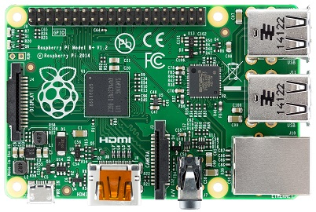
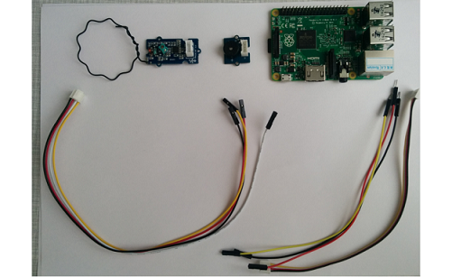
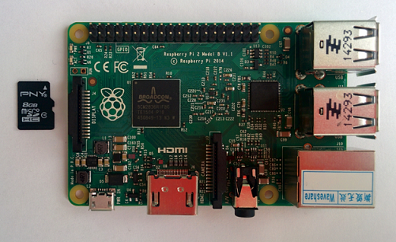
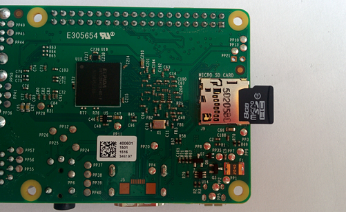

# 2. Raspberry Pi <a name="2"></a>
> Raspberry Pi — одноплатный компьютер размером с банковскую карту, изначально разработанный как бюджетная система для обучения информатике, 
впоследствии получивший намного более широкое применение и популярность, чем ожидали его авторы. 
>



**Raspberry PI**

## 2.1. Описание <a name="21"></a>
На плате размером с кредитную карту вы найдёте всё то, что можете найти в обычном персональном компьютере: процессор, оперативную память, 
разъёмы HDMI, USB, Ethernet, аналоговые аудио- и видеовыходы. Кроме того, на плате расположены 40 контактов ввода/вывода общего назначения. К 
ним вы сможете подключать периферию для взаимодействия с внешним миром: исполнительные устройства вроде реле и сервомоторов или же любые 
сенсоры; в общем всё, что работает от электричества.

Штатной операционной системой для Raspberry Pi является Linux. Она устанавливается на micro-SD карту, а та в свою очередь — в специальном 
слоте на плате. Если вы не знаете Linux, не стоит пугаться. Напротив: этот компьютер — прекрасная возможность во всём разобраться. Потерять 
данные или сильно напортачить с настройками не так страшно, ведь образ на SD-карте можно восстановить за считанные минуты. После этого можно 
продолжить эксперименты с чистого листа или с определённой контрольной точки.

### Порты и аппаратные интерфейсы <a name="211"></a>
Для подключения монитора или телевизора используются композитный видеовыход или разъём HDMI. Кроме того, заводские OEM ЖК-экраны могут быть 
подключены через интерфейс DSI.
Raspberry Pi 2 Model B предоставляет 4 USB-порта, объединённых внутренним хабом. К ним, помимо всего прочего, можно подключить клавиатуру и 
мышь.

В качестве низкоуровневых интерфейсов доступны:

- 40 портов ввода-вывода общего назначения
- UART (Serial)
- Шина I²C/TWI
- Шина SPI с селектором между двумя устройствами
- Пины питания: 3,3 В, 5 В и земля

Колонки или наушники могут быть подключены через стандартное гнездо для 3,5 мм джеков. Также звук может передаваться через интерфейс HDMI.
На Raspberry Pi Model B+ доступен Ethernet-адаптер на 10/100 Мбит с выходом на стандартное гнездо 8P8C (RJ45).

### 2.1.2. Распиновка платы <a name="212"></a>

**Распиновка Raspberry**

### 2.1.3. Питание <a name="213"></a>
Raspberry Pi Model B+ может быть запитана через microUSB-кабель или через пины питания.
Номинальное напряжение питания — 5 В. Компьютер потребляет до 800 мА без внешних устройств.
Аппаратный выключатель питания на плате отсутствует. Для включения компьютера достаточно просто подсоединить кабель питания. Для выключения 
используйте штатную функцию операционной системы.

****
## 2.2. Разбор тестового примера:<a name="22"></a> 

Нам необходимо следующее оборудование:



Берем Raspberry и аккуратно достаем карту памяти из прозрачного бокса.



Прежде всего нужно установить SD-карту с операционной системой Raspbian в соответствущее гнездо на плате Raspberry. В гнезде плата фиксируется 
благодаря блокирующему механизму. Для надежного закрепления нужно аккуратно вдавить пальцем карту в гнездо.



## 2.3. Настройка SSH соединения с Raspberry Pi <a name="23"></a>

Используя ОС Linux выполнить подключение к RPi можно следующим образом:
```
ssh pi@XX.XX.XX.XX
```
где XX.XX.XX.XX - ранее определенный ip адрес устройства. 

Если вы работаете в ОС Windows, то вам нужно воспользоваться программой Putty.
В поле Имя хоста указываем ip адрес Raspberry в сети, порт 22 и тип подключения SSH.

Пароль пользователя pi: raspberry

***
## 2.4. Как узнать адрес Raspberry? <a name="24"></a>

* В Ubuntu выполните команду *sudo nmap –sn < ip-адрес компьютера >/< маска >*.  Пример:

 *sudo nmap -sn 192.168.1.0/24 -p 22*

* В Windows скачайте любое приложение, сканирующее адреса (к примеру, Advanced IP Scanner). Просканируйте сеть, в которой находится компьютер.
* В списке найдите устройство с именем, подобным “Raspberry PI”.
Если вы обнаружите несоклько микрокомпьютеров “Raspberry PI” в вашей сети, вам понадобится узнать т.н. MAC адрес устройства - уникальный идентификатор сетевого устройства, состоящий из 6 байт. Узнать его можно по команде:

```shell
$ ifconfig
$ eth0      Link encap:Ethernet  HWaddr `28:d2:44:69:2a:c8` 
```

Также вы можете определить вашу плату по уникальному имени устройства `hostname` в файле /etc/hosname:
```shell
$ cat /etc/hostame
$ host10
```
В исключительном случае вы можете обнаружить вашу плату опытным путем, отключая и подключая свой Pi к сети.


## 2.5. Установка и запуск VNC сервера <a name="25"></a>

Для установки VNC сервера необходимо выполнить команды:
```
apt-get install tightvncserver
```
При инсталляции установить пароль для подключения к серверу: raspberry.
```
vncserver :1 -geometry 1280x1024 -depth 24
```
Проверить работоспособность сервера, подключившись к RPi с персонального компьютера. Для этого в операционной системе Windows использовать прграмму tightvncclient: [Клиенты](http://sourceforge.net/projects/vnc-tight/files/latest/download)

Для операционной системы Linux можно использовать приложение xtightvncviewer.

Настройки клинета для доступа к серверу:
Сервер: `XX.XX.XX.XX : D` 
где  `XX.XX.XX.XX` – ip адрес платы Raspberry, `D` : номер экрана (в примере  D=1)
Логин: pi
Пароль: raspberry

***
## 2.6. Полезные команды для работы в ОС Raspbian <a name="26"></a>

-   "top" — запуск предустановленного в Raspbian диспетчера задач;
-   "sudo raspi-config" — запуск первоначального меню настроек;
-   "sudo passwd root" — создание пароля для пользователя root;
-   "startx" — запуск графической оболочки;
-   "sudo halt" — выключение RPi;
-   "logout" — выход из системы;
-   "sudo reboot" — перезагрузка RPi;
-   "cd" — переход в необходимую директорию, например, для перехода в директорию /etc/network/ - "cd /etc/network/"
-   "pwd" — путь до текущей директории;
-   "dir" — содержимое текущей директории;
-   "mkdir" — создание директории. Например, "mkdir /home/pitest/" создаст директорию "pitest";
-   "rmdir" — удаление директории. Например, "mdir /home/pitest/" - удаление директории "pitest";
-   "cat" — открыть файл для чтения. Например, "cat /etc/network/interfaces" покажет содержимое файла "interfaces";
-   "nano" — открыть файл для редактирования. Например, "nano
-   /etc/network/interfaces" откроет для редактирования файл "interfaces";
-   "ifconfig" — отобразит текущую конфигурацию сети;
-   "df" — выведет в консоли свободное и используемое дисковое пространство для всех разделов файловой системы;
-   "clear" — очистить экран терминала;
-   "Ctrl"+"Ins" — скопировать выделенное (текст);
-   "Shift"+"Ins" — вставить из буфера (текст);
-   "sudo" — выполнения команд c правами root пользователя. Например, это актуально, если вы зашли под пользователем "pi" и хотите из консоли 
отредактировать какой-нибудь системный файл - "sudo nano путь_до_файла";
-   "Ctrl"+"C" — остановка текущего действия/выход из консольного приложения;
-   "sudo apt-get update" — обновление списка доступных пакетов;
-   "sudo apt-get upgrade" — обновление установленных пакетов;
-   "sudo apt-get install" — установка необходимого пакета. Например, для
установки консольного браузера Links вводим "sudo apt-get install links".

***
## 2.7. Программирование <a name="27"></a>

В качестве языка программирования выбран Python из-за своего удобства работы с базами данных и серверой частью.

в консоли SSH соединения с Raspberry делаем последовательно следующее:

Переход в ваш домашний каталог
```shell
$ cd ~
```
Создание папки для Хакатона
```shell
$ mkdir hackathon
$ cd hackathon
```
Далее можно приступать к написанию кода приема данных от электроэнцефалографа.


