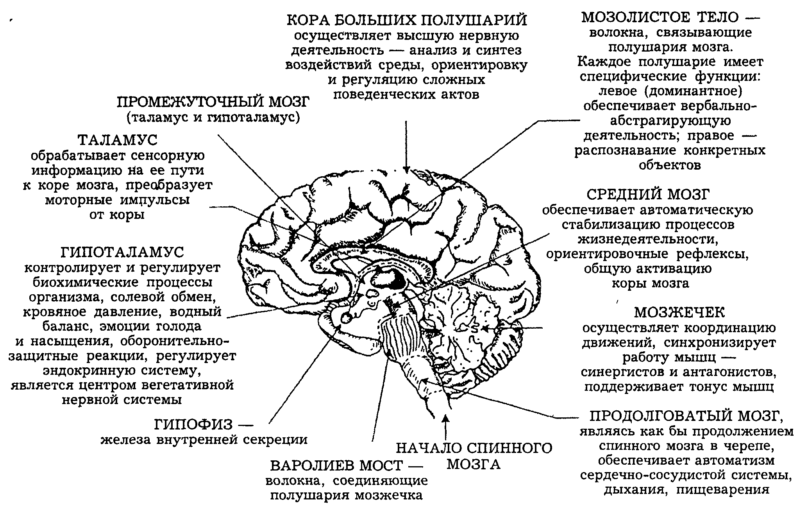
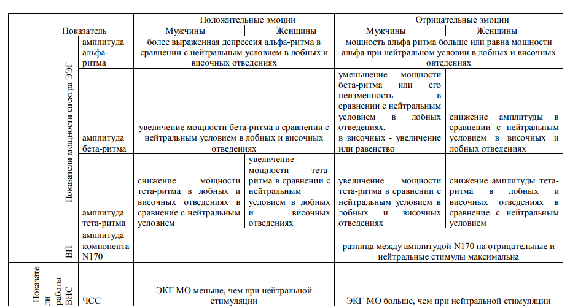
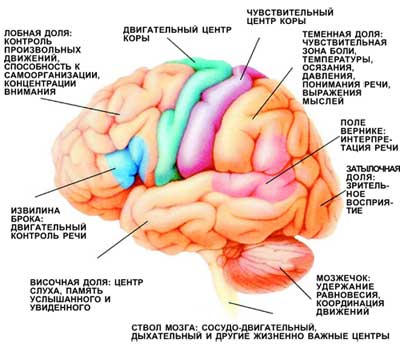
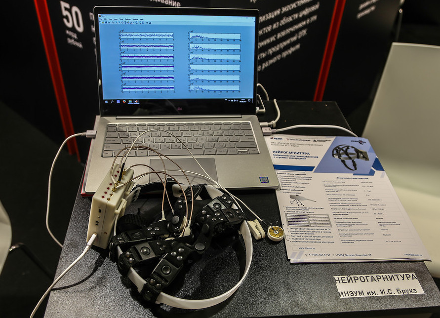
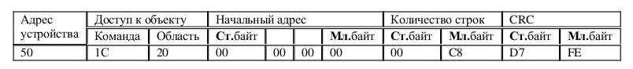
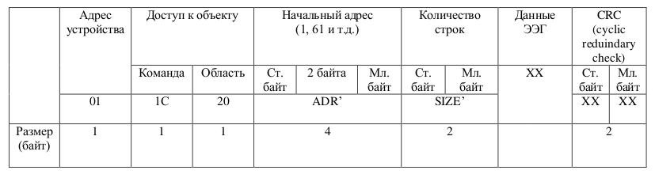

****
# 3. Принцип действия электроэнцефалографа<a name="3"></a>


ЭЭГ представляет собой сложный колебательный электрический процесс, который может быть зарегистрирован при расположении электродов на мозге или на поверхности скальпа, и является результатом электрической суммации и фильтрации элементарных процессов, протекающих в нейронах головного мозга.


****
## 3.1. Основы электроэнцефалографии головного мозга человека <a name="31"></a>


Многочисленные исследования показывают, что электрические потенциалы отдельных нейронов головного мозга связаны тесной и достаточно точной количественной зависимостью с информационными процессами. Для того чтобы нейрон генерировал потенциал действия, передающий сообщение другим нейронам или эффекторным органам, необходимо, чтобы собственное его возбуждение достигло определенной пороговой величины.

Уровень возбуждения нейрона определяется суммой возбуждающих и тормозных воздействий, оказываемых на него в данный момент через синапсы. Если сумма возбуждающих воздействий больше суммы тормозных на величину, превышающую пороговый уровень, нейрон генерирует нервный импульс, распространяющийся затем по аксону. Описанным тормозным и возбуждающим процессам в нейроне и его отростках соответствуют определенной формы электрические потенциалы.

Как показано выше, электрическая активность отдельных нервных клеток отражает их функциональную активность по переработке и передаче информации. Отсюда можно сделать заключение, что суммарная ЭЭГ также в преформированном виде отражает функциональную активность, но уже не отдельных нервных клеток, а их громадных популяций, т.е., иначе говоря, функциональную активность мозга. Это положение, получившее многочисленные неоспоримые доказательства, представляется исключительно важным для анализа ЭЭГ, поскольку дает ключ к пониманию того, какие системы мозга определяют внешний вид и внутреннюю организацию ЭЭГ.


**Основные отделы головного мозга человека**



**Применение ЭЭГ для анализа ритмов**


**Активность участков головного мозга человека**


****
## 3.2. Восьмиканальный электроэнцефалограф ИНЭУМ им.И.С.Брука <a name="32"></a>


Электроэнцефалограф производства компании ИНЭУМ им.И.С.Брука представляют собой многоканальные регистрирующие устройства, объединяющие 8 идентичных усилительно-регистрирующих блоков (каналов), позволяющих таким образом регистрировать одномоментно электрическую активность от соответствующего числа пар электродов, установленных на голове обследуемого.

Электроэнцефалограф ООО ИНЭУМ им.И.С.Брука цифрового типа с сухими эоектродами преобразуют ЭЭГ в цифровую форму и вводят ее в микроконтроллер STM32, который управляет  непрерывный процесс регистрации ЭЭГ, одновременно записываемой в память компьютера.


**Электроэнцефалограф ИНЭУМ им.И.С.Брука**	


Микроконтроллер STM32 реализует систему генерации управления исполнительными механизмами и потоковую передачу данных по протоколу MODICON MODBUS RTU. 
Протокол реализован на физических линиях интерейса RS232 через микросхему FTDI, транслирущую пакеты RS232 в `USB`. Таким образом, прием и передача пакетов ЭЭГ может босуществяться по интерфейсу USB. 

Для получения доступа к отснятым или уже обработанным данным необходимо выдать ряд команд инициализации, а также команд запросов в формате, представленном ниже:



**Формат пакета запроса**


Ниже приведен код инициализации электроэнцефалографа. 

```
ser = serial.Serial("/dev/ttyUSB0")
ser.baudrate = 460800

if ser.isOpen():
    ser.close()
ser.open()
ser.isOpen()

# посылаем команду записи в регистр 0x39 значения 0x214
ser.write("/put/memory?address=39&value=214&\r".encode())
time.sleep(5)
ser.write("/put/memory?address=40&value=194&\r".encode())
time.sleep(5)
ser.write("/put/memory?address=41&value=96&\r".encode())
time.sleep(5)
ser.write("/put/memory?address=42&value=0&\r".encode())

# И так далее ....

# завершаем инициализация
ser.write("/put/memory?address=52&value=1&\r".encode())
time.sleep(3)


```


В ответ на команды, электроэнцефалограф входит в режим постоянной генерации пакетов данных. Для обработки пакета необходимо обнаружить 
заголовок `0x01,0x1C,0x20`, посде чего читается количество байт данных (стандарное количество составляе 512 байт). Далее проверяется `CRC`.



**Формат пакета ответа**

Код парсера пакета показан ниже:

```
def receive_data_from_eeg():

	
	# массив FiFo
 	global valuechannel1
  	global valuechannel2
  	global valuechannel3
	global learnData
	global education

	valuechannel1.clear()
	valuechannel2.clear()
	valuechannel3.clear()

	#wait 100 ms	
	time.sleep(0.1)
	begin_time = time.time()
  	buffer_lst = []
	learnData=[]
  	counter = 0
	break_flag = False
  	while not(break_flag) : # Цикл 
	  	data_of_byte = get(3)
	  	header = change3byte(data_of_byte)
	  	headerfirstbyte = int(header[0])
	  	headersecondbyte = int(header[1])
	  	headerthirtbyte = int(header[2])
	  	# Проверка заголок пакета
	   	while headerfirstbyte != 1 and headersecondbyte != 28 and headerthirtbyte != 32:
	    		data_of_byte = data_of_byte[1:]
	    		data_of_byte += get(1)
	    		header_nextbyte = changebyte(data_of_byte[2])
	    		headerfirstbyte = headersecondbyte
	    		headersecondbyte = headerthirtbyte
	    		headerthirtbyte = int(header_nextbyte[0])
	   	if headerfirstbyte == 1 and headersecondbyte == 28 and headerthirtbyte == 32:
	    		data_of_byte = data_of_byte + get(520) 
	    		size = change2byte(data_of_byte[7:9]) #Информация об объеме данных
	    		if int(size[0]) == 512: #Проверка размеров данных
	     			x = 9
	     			data_for_matrix = data_of_byte[0:521] #Данные от 16 сэмплов
	     			crc = data_of_byte[521:523] #CRC
	     			matrix_of_value = [[0] * 16 for i in range(8)]
	     			for i in range(16):
	      				for j in range(8):
						value = change4byte(data_for_matrix[x:x+4])
						x += 4 #Шаг по 4 байта
						buffer_lst.append(int(value[0]))
						matrix_of_value[j][i] = buffer_lst[:] #Ввод данных в массив
						del buffer_lst[:]
	     			crc_check = calc(data_for_matrix)
	     			crc = ''.join([ crc[x:x+2][::-1] for x in range(0, len(crc), 2) ])
	     			crc = change2byteCRC(crc)
	    			if int(crc[0]) == crc_check: #Сравнения CRC
	       				end_time = time.time()
	       				my_time = end_time - begin_time 
	       				if counter < 4 : #Пока не получим 4 пакета (но не менее 500 мс от начала предъявления)
						valuechannel1.append(matrix_of_value[0:15][0])
						valuechannel2.append(matrix_of_value[1:15][0])
						valuechannel3.append(matrix_of_value[2:15][0])
						counter += 1
	       				else: #Иначе отправка данных в Bluemix + очистка FiFo
						# 
						for i in range(4):
							for j in range (16):
								learnData+=valuechannel1[i][j]
								learnData+=valuechannel2[i][j]
								learnData+=valuechannel3[i][j]
						print "__________________"
						print learnData
						print "__________________"
						counter = 0
						background_image=Tk.PhotoImage(file="right.png")
						time.sleep(0.5) #Задержка 500 мс
						begin_time = time.time()
						break_flag = True


```


Код проверки CRC

```
# Преобразование данных
def changebyte(needbyte):
	return  struct.unpack('b', needbyte)
def change2byteCRC(need2byteCRC):
  return  struct.unpack('h', need2byteCRC)
def change2byte(need2byte):
	return  struct.unpack('>h', need2byte)
def change3byte(need3byte):
	return  struct.unpack('BBB', need3byte)
def change4byte(need4byte):
	return  struct.unpack('>i', need4byte)

# Вычисление CRC
def calc(data):
        crc_table=[
0x0000,0xC0C1,0xC181,0x0140,0xC301,0x03C0,0x0280,0xC241,0xC601,0x06C0,0x0780,0xC741,0x0500,0xC5C1,0xC481,0x0440,
0xCC01,0x0CC0,0x0D80,0xCD41,0x0F00,0xCFC1,0xCE81,0x0E40,0x0A00,0xCAC1,0xCB81,0x0B40,0xC901,0x09C0,0x0880,0xC841,
0xD801,0x18C0,0x1980,0xD941,0x1B00,0xDBC1,0xDA81,0x1A40,0x1E00,0xDEC1,0xDF81,0x1F40,0xDD01,0x1DC0,0x1C80,0xDC41,
0x1400,0xD4C1,0xD581,0x1540,0xD701,0x17C0,0x1680,0xD641,0xD201,0x12C0,0x1380,0xD341,0x1100,0xD1C1,0xD081,0x1040,
0xF001,0x30C0,0x3180,0xF141,0x3300,0xF3C1,0xF281,0x3240,0x3600,0xF6C1,0xF781,0x3740,0xF501,0x35C0,0x3480,0xF441,
0x3C00,0xFCC1,0xFD81,0x3D40,0xFF01,0x3FC0,0x3E80,0xFE41,0xFA01,0x3AC0,0x3B80,0xFB41,0x3900,0xF9C1,0xF881,0x3840,
0x2800,0xE8C1,0xE981,0x2940,0xEB01,0x2BC0,0x2A80,0xEA41,0xEE01,0x2EC0,0x2F80,0xEF41,0x2D00,0xEDC1,0xEC81,0x2C40,
0xE401,0x24C0,0x2580,0xE541,0x2700,0xE7C1,0xE681,0x2640,0x2200,0xE2C1,0xE381,0x2340,0xE101,0x21C0,0x2080,0xE041,
0xA001,0x60C0,0x6180,0xA141,0x6300,0xA3C1,0xA281,0x6240,0x6600,0xA6C1,0xA781,0x6740,0xA501,0x65C0,0x6480,0xA441,
0x6C00,0xACC1,0xAD81,0x6D40,0xAF01,0x6FC0,0x6E80,0xAE41,0xAA01,0x6AC0,0x6B80,0xAB41,0x6900,0xA9C1,0xA881,0x6840,
0x7800,0xB8C1,0xB981,0x7940,0xBB01,0x7BC0,0x7A80,0xBA41,0xBE01,0x7EC0,0x7F80,0xBF41,0x7D00,0xBDC1,0xBC81,0x7C40,
0xB401,0x74C0,0x7580,0xB541,0x7700,0xB7C1,0xB681,0x7640,0x7200,0xB2C1,0xB381,0x7340,0xB101,0x71C0,0x7080,0xB041,
0x5000,0x90C1,0x9181,0x5140,0x9301,0x53C0,0x5280,0x9241,0x9601,0x56C0,0x5780,0x9741,0x5500,0x95C1,0x9481,0x5440,
0x9C01,0x5CC0,0x5D80,0x9D41,0x5F00,0x9FC1,0x9E81,0x5E40,0x5A00,0x9AC1,0x9B81,0x5B40,0x9901,0x59C0,0x5880,0x9841,
0x8801,0x48C0,0x4980,0x8941,0x4B00,0x8BC1,0x8A81,0x4A40,0x4E00,0x8EC1,0x8F81,0x4F40,0x8D01,0x4DC0,0x4C80,0x8C41,
0x4400,0x84C1,0x8581,0x4540,0x8701,0x47C0,0x4680,0x8641,0x8201,0x42C0,0x4380,0x8341,0x4100,0x81C1,0x8081,0x4040]

        crc_hi=0xFF
        crc_lo=0xFF

        for w in data:
                index=crc_lo ^ ord(w)
                crc_val=crc_table[index]
                crc_temp=crc_val/256
                crc_val_low=crc_val-(crc_temp*256)
                crc_lo=crc_val_low ^ crc_hi
                crc_hi=crc_temp

        crc=crc_hi*256 +crc_lo
        return crc

```

Для удобства отладки проектов мы записали 60 пакетов данных в файл `eeg.dat`. Чтобы использовать данные из файлов, вместо реальных данных с электроэнцефалографа, неоюбходимо установить переменную `state` в состояние "0". При отладке на энцефалографе не забудьте установить `state = 1`.

```
datafile = "eeg.dat"

# режим работы
# state = 1 	#Данные поступают из электроэнцефалографа
state = 0 	#Данные поступают из файла datafile

if state == 1:
	ser = serial.Serial("/dev/ttyUSB0")


``` 

Выполним тестирование примера:
-	Войдите в raspberry через консоль `ssh`.
-	`cd ./hackathon`
-	`mkdir stage1`
-	`cd stage1`
-	`wget https://github.com/alexbmstu/bmstu-hackathon/raw/master/src/stage1/stage1.zip`
-	`unzip stage1.zip`
-	`python hackathon.py`


ПРоверьте работоспособность Вашего кода для state=0 и для state=1 (на приборе). 


