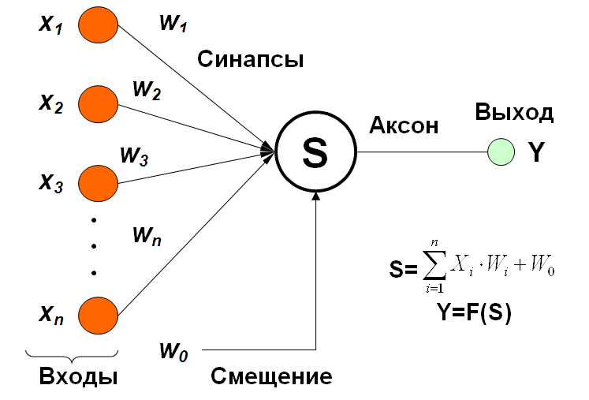
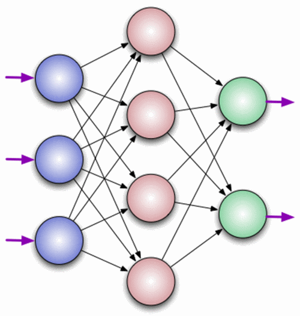

****
# 3. Нейронные сети<a name="3"></a>

****

## 3.1 Немного теории<a name="31"></a>

Нейронной сетью называется математическая модель, реализующая фукнции искусственного интеллекта путём воспроизведения нервной системы человека. Они используются для решения сложных задач, которые требуют аналитических вычислений, подобных тем, что делает человеческий мозг. К таким задачам относятся, например, классификация, кластеризация, прогнозирование, распознавание и т.д.

Искусственный нейрон представляет собой сумматор входных сигналов, применяющий к полученной взвешенной сумме некоторую простую функцию. Нейрон имеет синапсы - однонаправленные входные связи, соединённые с выходами других нейронов, а также аксон - выходную связь.

 
Текущее состояние нейрона определяется взвешенной суммой его входов (см. схему). Выход нейрона определяется его активационной функцией.

Совокупность нейронов, расположенных на одном уровне в нейронной сети, называется слоем. В общем случае нейронная сеть включает в себя входной, выходной и промежуточные слои. Нейроны входного и выходного слоёв, как правило, имеют линейную функцию активации и предназначены для приёма и передачи данных. Нейроны промежуточных слоёв - нелинейные; их функцией активации чаще всего является сигмоид (логистическая функция):


На схеме показан пример полносвязной нейронной сети, имеющей входной, промежуточный и выходной слои.


Нейронная сеть обучаема. В процессе обучения параметры сети настраиваются в соответствии с обучающими наборами данных, моделирующих среду, в которой будет функционировать сеть. В зависимости от способа подстройки параметров различают обучение с учителем и без учителя.

Обучение с учителем представляет собой предъявление сети выборки обучающих примеров. Каждый образец подаётся на входы сети, проходит обработку и перерабатывается в выходной сигнал, который сравнивается с эталонным значением. Затем в зависимости от степени расхождения реального и идеального результатов изменяются весовые коэффициенты связей внутри сети. Обучение длится до тех пор, пока ошибка по всему обучающему массиву не достигнет приемлемо низкого уровня.

При обучении без учителя обучающее множество состоит лишь из входных векторов. Алгоритм обучения подстраивает веса внутри сети так, чтобы предъявление достаточно близких входных векторов давало одинаковые результаты.

Почитать подробнее про нейронные сети можно [здесь](http://www.aiportal.ru/articles/neural-networks "Статьи о нейронных сетях").

****

## 3.2 Как выбрать топологию нейронной сети? <a name="32"></a>

В первую очередь нужно проанализировать задачу, для решения которой создаётся нейронная сеть.

Наша задача - обработать сигналы, поступающие от ЭЭГ, и определить, какой реакции они соответствуют. Сигнал от ЭЭГ представляет собой совокупность из 64 целочисленных значений, которые мы будем называть признаками. На выходе нейронной сети нам нужно получать вектор значений, который будет обозначать тип распознанной реакции. Единичное значение i-го элемента выходного вектора означает, что обнаружена соответствующая ему i-я реакция. Также может быть, что выходной вектор состоит из нулей: это значит, что на вход подан набор признаков, описывающий неизвестную сети реакцию.

Мы будем распознавать реакции двух типов: "Влево" и "Вправо".

За основу возьмём многослойный перцептрон - модель сенсорного нейрона, способного воспринимать, анализировать и реагировать на раздражение. Число слоёв в общем случае определяется требуемой точностью и производительностью вычислений.

Существует теорема о количестве слоёв, согласно которой:

1. Если функция определена на конечном множестве точек, то 3-ехслойный перцептрон способен ее апроксимировать.

2. Если функция непрерывна и определена на компактной области, то 3-ехслойный перцептрон способен ее апроксимировать.

3. Остальные функции, которым могут быть обучены нейронные сети, могут быть апроксимированы 4-ехслойным перцетроном.

На практике может использоваться и большее число слоёв, но с его увеличением возрастает сложность сети, время её обучения и работы и объём требуемых ресурсов. Здесь мы рассмотрим 4-слойный перцептрон.

Для лучшей работы сети входные данные нужно нормировать - привести к отрезку [0, 1]. Проще всего сделать это по следующей формуле:


Число нейронов во входном слое совпадает с числом входных признаков: i = 64.

Число нейронов в выходном слое совпадает с числом распознаваемых реакций: o = 2.

Число нейронов в промежуточных слоях, как правило, определяется экспериментально, однако существуют эмпирически выведенные [рекомендации](http://mei06.narod.ru/sem7/iis/shpora/page2_9.htm) для 4-слойного перцептрона:


Выберем в качестве функции активации нейронов скрытых слоёв сигмоид.

Обучать сеть будем по алгоритму обратного распространения ошибки. Этот метод относится к классу обучения с учителем. Краткое разъяснение принципов работы этого алгоритма изложено [здесь](http://www.aiportal.ru/articles/neural-networks/back-propagation.html "Алгоритм обратного распространения ошибки").

Этот базовый проект можно улучшить, меняя число слоёв, число нейронов в скрытых слоях, активационные функции, способ обучения и многое другое. О том, как это сделать, а также о том, как построить базовый вариант - следующий раздел.

****

## 3.3 Бибилиотека PyBrain <a name="33"></a>

PyBrain предоставляет инструментарий для работы с нейронными сетями на языке Python. Документация по PyBrain находится [здесь](http://pybrain.org/docs/index.html "Документация PyBrain").

Приведём пример работы с нейронной сетью с помощью PyBrain.

PyBrain подключается при помощи следующей директивы:

```
import pybrain
```

Самый простой способ создать сеть - воспользоваться функцией buildNetwork:

```
net = buildNetwork(64, 20, 6, 2, bias=True, hiddenclass=SigmoidLayer)
```

Рассмотрим более подробно, что происходит при создании сети:

```
def constructPerceptron (name, numNeurons):
    """Возвращает необученную сеть

    Аргументы:
    name -- имя сети, строка
    numNeurons -- число нейронов в каждом слое, список из целых чисел

    """
    # Создаём сеть
    net = FeedForwardNetwork(name)
    # Создаём слои и добавляем их в сеть
    prevLayer = None
    newLayer = None
    for i, val in enumerate(numNeurons):
        # Если слой входной, он линейный
        if (i == 0): 
            newLayer = LinearLayer(val, 'input')
            net.addInputModule(newLayer)
            prevLayer = newLayer
        # Если слой выходной, он линейный    
        elif (i == len(numNeurons) - 1):
            newLayer = LinearLayer(val, 'output')
            net.addOutputModule(newLayer)
        # Иначе - слой сигмоидный   
        else:
            newLayer = SigmoidLayer(val, 'hidden_' + str(i))
            net.addModule(newLayer)    
        # Если слой не входной, создаём связь между новым и предыдущим слоями
        if (i > 0):
            conn = FullConnection(prevLayer, newLayer, 'conn_' + str(i))
            net.addConnection(conn)
            prevLayer = newLayer
    # Готовим сеть к активации, упорядочивая её внутреннюю структуру        
    net.sortModules()
    # Готово
    return net
```

Далее нам нужно обучить сеть. Для этого необходимо получить обучающую выборку и преобразовать её к требуемому формату.

Каждая обучающая пара состоит из двух элементов: вектора признаков (64 числа) и выходного вектора-образца (2 числа). Фактически оба эти элемента - кортежи из чисел, например, такие: i_data = (0.5, 1, 0, 0.2, ..., 0.7); o_data = (0, 1). 

Объединим вектор признаков и вектор результата в единый кортеж и получим обучающую пару: learnPair = (i_data, o_data).

Наконец, объединим все обучающие пары в список: learnData = [learnPair_1, learnPair_2, ..., learnPair_N].

В таком формате нужно предоставить обучающее множество функции, которая создаст из него dataset PyBrain:

```
def constructDataset (name, learnData):
    """Возвращает обучающую выборку в формате PyBrain

    Аргументы:
    name -- имя набора данных, строка
    learnData -- данные для обучения: список кортежей типа "входные признаки - выходной вектор"

    """
    # Вычисляем размерность входных данных
    dimIn = len(learnData[0][0])
    dimOut = len (learnData[0][1])
    ds = SupervisedDataSet(dimIn, dimOut)
    for d in learnData:
        ds.addSample(d[0], d[1])
    return ds
```

Теперь сеть можно обучать. Будем тренировать сеть на заданном наборе в течение одной эпохи, чтобы избежать переобучения. Чтобы следить за качеством обучения, будем также получать оценку ошибки.

```
def trainNetwork (net, trainData):
    """Возвращает сеть, прошедшую 1 эпоху обучения, и оценку ошибки

    Аргументы:
    net - нейронная сеть, PyBrain network
    trainData -- обучающий набор данных, PyBrain dataset

    """
	  # Трейнер для обучения с учителем
    trainer = BackpropTrainer(net, trainData)
	  # Запускаем трейнер на 1 эпоху и запоминаем оценку ошибки 
    coef = trainer.train()
    return (net, coef)
```

Простейший сценарий создания, обучения и использования сети выглядит так:

```
# Инициализация сети
n = constructPerceptron('perc', [64, 20, 6, 2]) # Создаём перцептрон
# Формирование обучающей выборки
# Данные для обучения data поступают от ЭЭГ в описанном выше формате - списке обучающих пар
ds = constructDataset('data', data)
# Запуск 1 полной эпохи обучения
(trained_net, err) = trainNetwork (n, ds)
# Активизируем сеть! На вход подаем i_vec - список из 64 чисел - вектор входных признаков
print(trained_net.activate(i_vec))
```

Сеть можно экспортировать и импортировать в виде xml-файла.

```
def saveNetwork (net, name):
    """Экспорт нейронной сети в файл

    Аргументы:
    net - нейронная сеть, PyBrain network
    name -- имя файла, строка

    """
    NetworkWriter.writeToFile(net, name)

def importNetwork (name):
    """Возвращает импортированную из файла нейронную сеть

    Аргументы:
    name - имя файла, строка

    """
    return NetworkReader.readFrom(name)    
	
# Сохранить сеть
saveNetwork(n, 'net.xml')
# Импортировать сеть
new_n = importNetwork('net.xml')
```

Любой объект библиотеки PyBrain можно распечатать при помощи функции print().

Чтобы изменить число слоёв или число нейронов в слоях сети, нужно подать соответствующий список чисел на вход функции, формирующей сеть.

Чтобы изменить типы скрытых слоёв, достаточно указать другое имя типа слоя при создании сети, например, TanhLayer - слой с активационной функцией в виде гиперболического тангенса.

PyBrain предоставляет также обширные возможности для обучения сети. Можно обучать сеть до достижения сходимости, применяя другой метод объекта trainer:

```
trainer.trainUntilConvergence()
```

Можно выбрать другой алгоритм обучения, меняя классы объектов dataset и trainer.

Эти и другие возможности библиотеки PyBrain описаны в [документации](http://pybrain.org/docs/index.html "Документация PyBrain").

