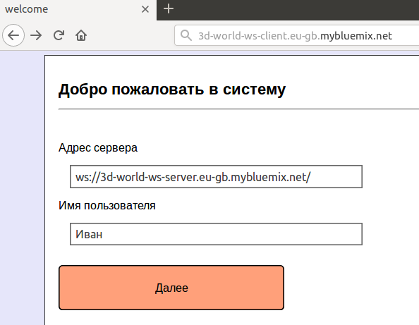
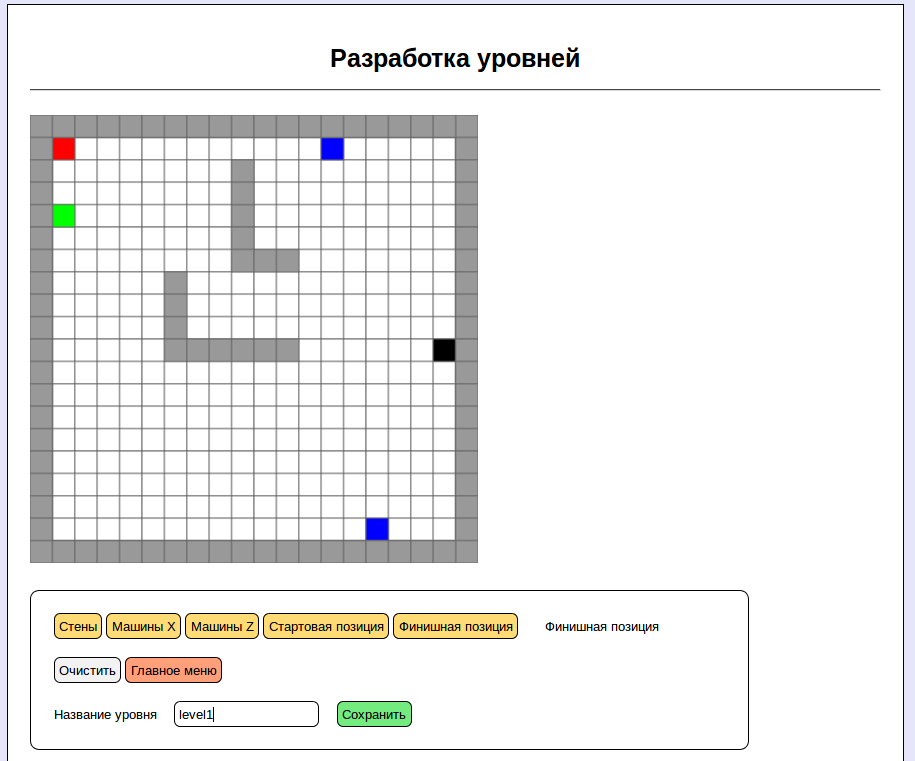
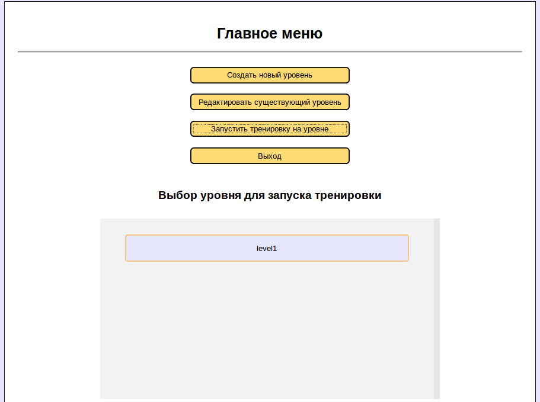
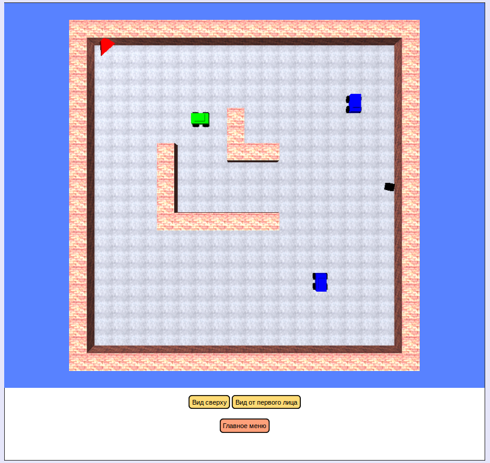
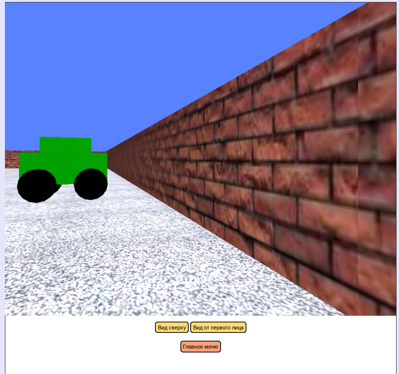
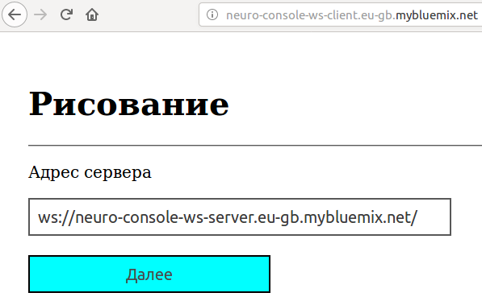
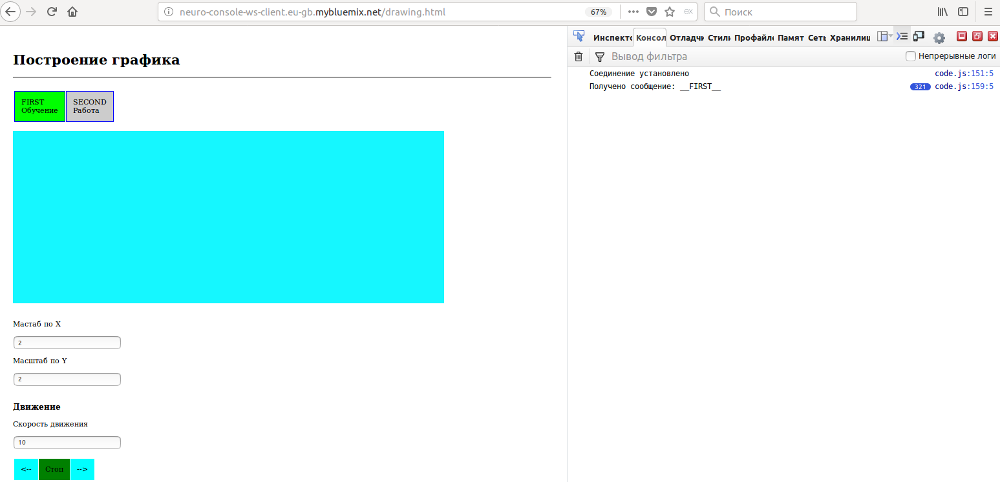
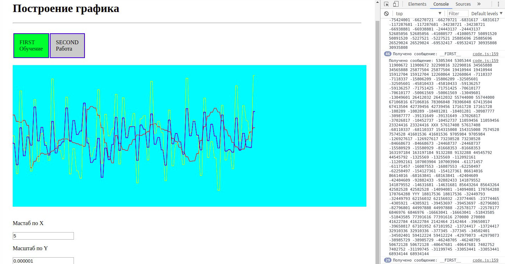

# 5. Тренажер управления инвалидной коляской <a name="5"></a>

****
## 5.1 Установка и настройка инструментов для работы с Bluemix<a name="51"></a>

  Для публикации проекта в облаке IBM Bluemix необходимо:

* Зарегистрироваться в Bluemix, выбрав в качестве региона GB

* Установить Docker для локального тестирования проекта, $ bx build & run будет собирать и запускать контейнер по Dockerfile из директории проекта
   
Для работы с Bluemix мы будем использовать операционную систему `Linux Ubuntu 16.04`. Вы можете использовать также другие сборки Linux или даже MS Windows. Если у вас нет под рукой компьютера с Linux вы можете развернуть виртуальную машину Ubuntu 16.04 на вашем компьютере.
Для этого можно использовать заранее подготовленные [образы для VirtualBox](http://www.osboxes.org/ubuntu-16-04-flavors-images-available-vmware-virtualbox/).


### 5.1.1 О Docker<a name="511"></a>
  Docker- программное обеспечение для автоматизации развёртывания и управления приложениями в среде виртуализации на уровне операционной системы; позволяет «упаковать» приложение со всем его окружением и зависимостями в контейнер, а также предоставляет среду по управлению контейнерами.

  Простыми словами, Docker это инструмент, который позволяет разработчикам, системными администраторам и другим специалистам разворачивать их приложения в песочнице (которые называются контейнерами), для запуска на целевой операционной системе, например, Linux. Ключевое преимущество Docker в том, что он позволяет пользователям упаковать приложение со всеми его зависимостями в стандартизированный модуль для разработки, таким образом, Docker избавляет от возможных ошибок системного администратора сервера. В отличие от виртуальных машин, контейнеры не создают дополнительной нагрузки, поэтому с ними можно использовать систему и ресурсы более эффективно.
  
  * Инструкция по установке `Docker` на `Ubuntu 16.04`: [инструкция](https://losst.ru/ustanovka-docker-na-ubuntu-16-04)

### 5.1.2. Установка Bluemix CLI <a name="512"></a>
* Скачиваем и устанавливаем Bluemix CLI (bx cli) [тут](https://console.bluemix.net/docs/cli/reference/bluemix_cli/get_started.html#getting-started). Далее:
  ```shell
  $ tar -xvf Bluemix_CLI.tar.gz
  $ cd Bluemix_CLI
  $ sudo ./install_bluemix_cli
  ```
* Теперь нам доступны команды bx - проверим: `$ bx --version`

* Логинимся под учетной записью IBM Bluemix:
  `$ bx login`
  
* Установим `dev` пакет для `bx` с [сайте](https://console.bluemix.net/docs/cloudnative/dev_cli.html#developercli)

`$ curl -sL https://ibm.biz/idt-installer | bash`  
  
* Подробнее о работе с Bluemix CLI:

https://console.bluemix.net/docs/cli/reference/bluemix_cli/get_started.html#getting-started

https://console.bluemix.net/docs/cli/reference/bluemix_cli/download_cli.html#download_install

### 5.1.3. Локальная сборка тестового проекта  <a name="513"></a>
* После установки `dev` пакета выбираем `Node.js + wepback` приложение из списка Starter Kit Bluemix: https://console.bluemix.net/developer/appservice/starter-kits

  Подробнее: https://console.bluemix.net/docs/cloudnative/tutorial_bff.html#code

* Нажимаем на Generate code и скачиваем архив с файлами тестового `hello world` приложения.
* Протестируем работоспособность приложения, развернув его локально. Для этого создадим и запустим контейнер:
```
bx dev build
bx dev run
```
* После этого вы сможете посмотреть результат запуска приложения в браузере: `localhost:3000`

  Выведем `hello world!` на стартовой странице приложения: в файле проекта `public/index.html` добавим
  
  `<h1> HELLO IBM! </h1>`

* Чтобы остановить контейнер: `Ctrl + С`

### 5.1.4. Публикации проекта в облаке Bluemix  <a name="514"></a>
* Настроим параметры ORG и SPACE (ключи `-o` и `-s`) в `bx` в соответствии с данными в Bluemix аккаунте:
`bx target -o Brainstormv2 -s space1`

  Должно получиться что-то подобное:
`$ bx login`
```
Authenticating...
OK
...
API endpoint:     https://api.eu-gb.bluemix.net (API version: 2.75.0)   
Region:           eu-gb   
User:             akenoq@yandex.ru   
Account:          BMSTU (eb7fb19a1c1e905a97abccf90b1d2d0b)   
Resource group:   Default   
Org:                 
Space:               
Tip: If you are managing Cloud Foundry applications and services
- Use 'bx target --cf' to target Cloud Foundry org/space interactively, or use 'bx target -o ORG -s SPACE' to target the org/space.
- Use 'bx cf' if you want to run the Cloud Foundry CLI with current Bluemix CLI context.
```

`$ bx target -o Brainstormv2 -s space1`
```
Targeted org Brainstormv2
Targeted space space1
                     
API endpoint:     https://api.eu-gb.bluemix.net (API version: 2.75.0)   
Region:           eu-gb   
User:             akenoq@yandex.ru   
Account:          BMSTU (eb7fb19a1c1e905a97abccf90b1d2d0b)   
Resource group:   Default   
Org:              Brainstormv2   
Space:            space1   
```
`$ bx dev deploy`

* Результат публикации можно посмотреть, перейдя по ссылке на ваше приложение. Ссылку можно найти в панели управления приложениями `Dashboard`: https://console.bluemix.net/dashboard/

### 5.1.5. Создание своего проекта  <a name="515"></a>
* Теперь попробуем опубликовать свое приложение.
  Заменим все директории со статикой в директории скачанного примера на свои, в примере ниже папка static
  + заменим package.json и webpack.config.js
  
  Пример package.json без сборobrf webpack:
  ```
  {
  "name": "socket-server",
  "version": "1.0.0",
  "description": "",
  "main": "index.js",
  "scripts": {
    "start": "node index.js",
    "test": "echo \"Error: no test specified\" && exit 1"
  },
  "keywords": [],
  "author": "",
  "license": "ISC",
  "dependencies": {
    "express": "^4.16.2",
    "http": "0.0.0",
    "request": "^2.83.0",
    "ws": "^3.3.1"
  }
  ``` 
  
  
  Пример содержимого в директории с готовым к развертыванию проектом:
`
ibm-project$ ls -1

cli-config.yml
Dockerfile
Dockerfile-tools
idt.js
index.js
LICENSE
manifest.yml
node_modules
node_modules_linux
package.json
README.md
RELEASE
static
webpack.config.js
`

* Проверим локально корректность получившегося проекта:
```
bx dev build
bx dev run
```
* Публикуем в облаке:
```
bx dev deploy
```

****
## 5.2 Работа с 3D-тренажером <a name="52"></a>

Скачиваем архив: https://github.com/akenoq/IBM_hackathon_deploy

В этом архиве файлы, необходимые для публикации в облаке Bluemix `3D-тренажера` и `приложения для построения графикаов` при помощи `StarterKit Node.js + webpack`. Каждая директория - одно приложение:

a. `3d-world-ws-client` - приложение 3D-тренажера

b. `3d-world-ws-server` - сокет-сервер на Node.js к которому подсоединен клиент1 - 3D-тренажер и клиент2 - RaspberryPi3

c. `neuro-console-ws-client` - приложение для построения графика по данным, полученным с энцефалографа (консоль)

d. `neuro-console-ws-server` - сокет-сервер на Node.js к которому подсоединен клиент1 - приложение для построения графика и клиент2 - Raspberry Pi3


### 5.2.1 Публикация и работа с 3D-тренажером

##### 1. Скачиваем архив: https://github.com/akenoq/IBM_hackathon_deploy

   В этом архиве файлы, необходимые для публикации в облаке Bluemix `3D-тренажера` и `приложения для построения графикаов` при помощи `StarterKit Node.js + webpack`. Каждая директория - одно приложение:

   a. `3d-world-ws-client` - приложение 3D-тренажера

   b. `3d-world-ws-server` - сокет-сервер на Node.js к которому подсоединен клиент1 - 3D-тренажер и клиент2 - RaspberryPi3

   c. `neuro-console-ws-client` - приложение для построения графика по данным, полученным с энцефалографа (консоль)

   d. `neuro-console-ws-server` - сокет-сервер на Node.js к которому подсоединен клиент1 - приложение для построения графика и клиент2 - Raspberry Pi3
    
##### 2. Публикация 3D-тренажера
    
   Для работы 3D-тренажера необходимо развернуть в облаке:
    
   a. `3d-world-ws-client` - приложение 3D-тренажера

   b. `3d-world-ws-server` - сокет-сервер на Node.js к которому подсоединен клиент1 - 3D-тренажер и клиент2 - RaspberryPi3

   Для этого, следуя инструкции с `5.1.3`, выбрав приложение `Node.js + webpack` из списка Starter Kit Bluemix: https://console.bluemix.net/developer/appservice/starter-kits и заменив `папки, package.json и webpack` в полученном starter-kit проекте на свои из директорий `a. и b.` см.выше.
  * Проверим локально корректность получившегося проекта:
```
bx dev build
bx dev run
```
   * Публикуем в облаке:
```
bx dev deploy
```
    
##### 3. Управляющие сигналы
 
  Управляющие сигналы в формате `W`, `A`, `S`, `D` + `__` ваша программа распознвания на RaspberryPi3 должна отправлять по 
    сокет-соединению на url развернутого сокет-сервера `3d-world-ws-server`: ws://your_server_name_for_3d-world-ws-server
    
   Примеры валидных данных: `W__`, `A__` или одноременно `WA__`
    
    
### 5.2.2 Публикация и работа с приложением для построения графиков

##### 1. Скачиваем архив: https://github.com/akenoq/IBM_hackathon_deploy

   В этом архиве файлы, необходимые для публикации в облаке Bluemix `3D-тренажера` и `приложения для построения графикаов` при помощи `StarterKit Node.js + webpack`. Каждая директория - одно приложение:

   a. `3d-world-ws-client` - приложение 3D-тренажера

   b. `3d-world-ws-server` - сокет-сервер на Node.js к которому подсоединен клиент1 - 3D-тренажер и клиент2 - RaspberryPi3

   c. `neuro-console-ws-client` - приложение для построения графика по данным, полученным с энцефалографа

   d. `neuro-console-ws-server` - сокет-сервер на Node.js к которому подсоединен клиент1 - приложение для построения графика и клиент2 - Raspberry Pi3
    
##### 2. Публикация приложения для построения графиков
    
   Для работы приложения необходимо развернуть в облаке:
    
   c. `neuro-console-ws-client` - приложение для построения графика по данным, полученным с энцефалографа (`консоль`)

   d. `neuro-console-ws-server` - сокет-сервер на Node.js к которому подсоединен клиент1 - приложение для построения графика и клиент2 - Raspberry Pi3
    
   Для этого, следуя инструкции с `5.1.3`, выбрав приложение `Node.js + webpack` из списка Starter Kit Bluemix: https://console.bluemix.net/developer/appservice/starter-kits и заменив `папки, package.json и webpack` в полученном starter-kit проекте на свои из директорий `c. и d.` см.выше.

  * Проверим локально корректность получившегося проекта:
```
bx dev build
bx dev run
```
  * Публикуем в облаке:
```
bx dev deploy
```

##### 3. Формат данных
    
   Для построения графиков для 3х каналов необходимо передавать с клиента-отправителя (Raspberry Pi3) на сокет сервер строку с данными. В строку помещаются массивы целых чисел (int) : числа одного маччива разделены `пробелами`, между 1м и 2м массивом разделитель `XXX`, между 2м и 3м - `YYY`.
    
   Формат:
    ```int int int ... XXX ... int int int ... YYY ... int int int```
    
   Пример:
    ```"1234567 1234567 1234567 XXX 2345678 2345678 2345678 YYY 3456789 3456789 3456789"```

****
## 5.3 Тестирование работы <a name="53"></a>
### 5.3.1 Тестирование работы 3D-тренажера

##### 1. Заходим на url 3D тренажера по `http` (так как вебсокеты в проекте работают по незашифрованному протоколу ws) и указываем url развернутого сокет-сервера `3d-world-ws-server`: ws://your_server_name_for_3d-world-ws-server/



   Нажиамем "Далее" и переходим в "Главное меню"


##### 2. Выбираем пункт "Создать новый уровень" и попадаем в редактор уровня.

  Перед нами появляется карта клеточного мира, которую мы будем редактировать. Для создания препятствий выбираем "Стены", "Машины X" (движение: влео-вправо) и "Машины Z" (движение: вверх-вниз). Также необходимо указать стартовую и финишную позицию (цель).
  
  Для удаления поставленного препятствия выберете "Стартовая позиция" и щелкните по удаляемому репятствию.


  
  Для сохранения необходимо указать имя уровня и нажать "Сохранить"
  
##### 3. Чтобы открыть созданные уровни для начала тренировки или редактирования выбираем соответствующие пукты "Главного меню".



##### 4. Для начала тренировки выбираем пункт меню "Запустить тренировку на уровне"

  Перед нами появляется страница режима тренировки. По-умолчанию установлен вид сверху.
  


  В панели управления режимом тренировки (под основным экраном тренажера) мы можем переключать вид соответствующими кнопками: вид сверху и вид от первого лица.
  


##### 5. Управление

  Управляющие сигналы в формате `W`, `A`, `S`, `D` + `__` ваша программа распознвания на RaspberryPi3 должна отправлять по сокет-соединению на url развернутого сокет-сервера `3d-world-ws-server`: ws://your_server_name_for_3d-world-ws-server
    
  Примеры валидных данных: `W__`, `A__` или одноременно `WA__`
  

### 5.3.2 Тестирование консоли с графиками
##### 1. Заходим на url консоли по `http` (так как вебсокеты в проекте работают по незашифрованному протоколу ws) и указываем url развернутого сокет-сервера `neuro-console-ws-server`: ws://your_server_name_for_neuro-console-ws-server/



  Нажиамем "Далее" и переходим в консоль. Перед нами поле, где будут отрисовываться графики, как только данные начнут поступать с Raspberry. Чтобы убедиться, что соединение установлено откроем "Инструменты разработчика" в браузере (F12)



##### 2. Запускаем клиента на расбери, который передает пакеты данных с энцефалографа.

   Формат:
    ```int int int ... XXX ... int int int ... YYY ... int int int```
    
   Пример:
    ```"1234567 1234567 1234567 XXX 2345678 2345678 2345678 YYY 3456789 3456789 3456789"```
    
   A. В директории с проектом выполнить `mkfifo fifo` => в директории появится файл fifo - именованный канал
    
   B. Для работы с веб-сокетами python на Raspberry необходимо установить библиотеку Websocket:
  
    `sudo pip install websocket-client`
    
   C. Сначала запускаем скрипт чтения из буфера `hackathon_Read-fifo-file_and_Send-ws.py`
  
  ```python
import websocket
import thread
import time

def on_message(ws, message):
    print(message)

def on_error(ws, error):
    print(error)

def on_close(ws):
    print("### closed ###")

def on_open(ws):
    print ('START READING')
    def run(*args):
        while True:
            s = ""
            fin_s = open('fifo', 'r')
            s = fin_s.read()
            fin_s.close()
            print("PRINT = ", s)
            time.sleep(0.2)
            ws.send(s)
        time.sleep(0.2)
        ws.close()
        print("thread terminating...")

    thread.start_new_thread(run, ())

if __name__ == "__main__":
    websocket.enableTrace(True)
    # указываем url к сокет-серверу
    ws = websocket.WebSocketApp("ws://your_server_name_for_neuro-console-ws-server/",
                                on_message=on_message,
                                on_error=on_error,
                                on_close=on_close)
    ws.on_open = on_open
    ws.run_forever()
  ```
  
   D. Далее, запускаем `основной скрипт` записи данных с  3х каналов ЭЭГ `hackathon.py`
      
   E. Результат можно видеть на графике в консоли

##### 3. Как только данные начнут поступать с Raspberry-клиента. Мы увидим результат на графике и в консоли




